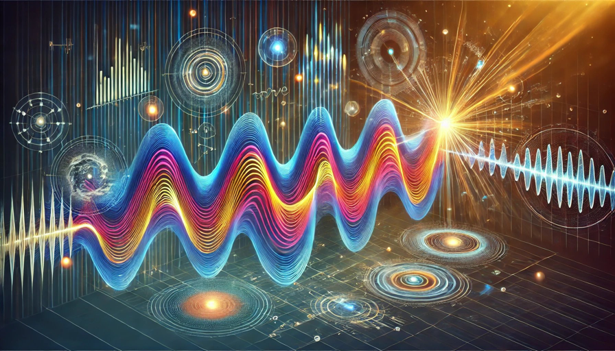

# 공부라는 프레임의 폐해 - 소리와 빛의 공통 상속성?

오늘 전기 얘기한 김에 프레임에 관한 생각 거리 또 하나 던져드릴게.

우리가 프레임에 너무도 자연스럽게 갇히는 이유 중 하나는... 응, 안타깝게도 교육 탓이야. 교육은 진짜 양날의 칼이니까.

과목을 나눠놓잖아. 그게 프레임이야. 같은 과목에서도 챕터도 나뉘고. 응, 그것도 프레임이야. 누구한테 어떻게 배우느냐도 중요하지만, 내가 어떻게 배우고 응용하느냐도 중요한 이유야.

간단한 문제 내볼게. 우리 다 배운 거야. 근데 누구한테 물어도 제대로 답을 못 해. 답을 해도 현실 세계에선 또 응용을 못 해. 왜 그럴지 고민해 보시라고.

소리와 빛의 상속성이 뭘까? 간단하게 둘의 공통점을 생각해 보면 돼.

아마 물리 공부하는 고삐리면 금새 답을 할 수도 있을 거야. 과학 관심 많은 분도 그럴 거고...

응, 둘다 파동성을 띈다는 거야. 소리는 주파수, 웨이브 파형 같은 게 있으니까 쉽게 이해하실 거고, 빛은? 두 가지 성질이 있거든. 입자성과 파동성. 

여러분이 상식적으로 익숙한 빛이 직진하고 입사각에 맞게 칼같이 반사되고, 응 그런건 주로 입자성으로 설명할 수 있어. 물론 파동성으로도 설명 가능한데, 입자성으로 보는 게 더 직관적이거든. 당구공 떠올려 보셔. 소리도 입자성이 없는 건 아닌데 너~~~무 깊이 들어가는 거니 주로 파동성으로 설명할 뿐이야.

근데 물에 수제비 뜨면 장애물 피해가면서 뒤에도 파동이 생기잖아? 응, 빛도 그래. 문을 살짝 열어봐. 빛이 아마 오쟈마시마스~~~ 하면서 돌아들어갈 거야. 그렇게 뒤쪽에도 슬그머니 광자들이 흘러들어가는 회절 현상은 빛의 파동성 때문이야. 회절 현상은 틈이 작을수록 잘 일어나니까 너무 활짝 열어놓고 '왜 안되지?' 하지 마시고. 과학자들도 이걸 꽤나 늦게 발견했어. 이른바 이중슬릿 실험이란 걸 통해서.

양자역학까진 안 들어갈게 너무 길어질 테니까.

여기까진 대충 기억들 나실 거야. 그럼 현실 생활에 응용해보라고. 현실에서 보는 소리와 빛의 파동성으로 발생하는 여러가지 현상들, 설명해 보시라고. 이런 건 시험에 안 나오거든.

간단해. 뭐 이런 거야. 제5원소에 나오는 외계인 소프라노나 파리넬리 수준의 소프라노라면 유리잔을 깨거든. 고주파일수록 파장이 짧아서야. 저주파면 파장이 막 몇 미터에서 몇 십미터까지도 가기 때문에 멀리는 가는데 힘이 약해. 극장이나 홈씨어터에서 울리는 서브우퍼 소리로 그 서브우퍼의 방향을 알 수 없는 이유야. 너무 파장이 길어서 우리 귀에 잘 안 걸리거든. 그래서 서브우퍼 설치할 때 반대로 하는 거야. 내가 청취할 자리에 서브우퍼를 놓고, 돌아다니면서 저음이 잘 들리는 곳을 찾아서 거기 서브우퍼를 놓는 거지. 해보면 알지만 정말 엉뚱한 곳에 놓아야 해. 미관상 개판이지. 

그럼 또 생각해봐. 어차피 빛도 파동성이 있으니까 파장이 짧은 쪽이 에너지가 세겠지, 소리처럼? 응, 그래서 빨주노초파남보 자외선으로 갈수록 에너지가 조낸 쎄지는 거야. 

간단해, 긴 간격으로 한대씩 맞는 거보다 1초에 수백만 번 조낸 얻어터지는 거나 같아. 초당 440번 얻어터지는 거랑 44만번 얻어터지는 거랑 어디가 더 아플까? 응, 후자면 피떡돼서 죽는 거야.

그래서 원전에서 나오는 감마레이가 조낸 무서운 거야. 전자기파 중에서도 극단적으로 파장이 짧은 녀석이니까. 맞는 순간 세상을 뜨거나, 헐크가 되거나, 그런 거지.

근데 얘네들은 멀리 못 간다고 했잖아. 파장이 짧으니까. 또, 에너지의 특징 중 하나가 장애물을 만나면 조금씩 약해진다는 거야. 차 달릴 때 브레이크로 제동 거는 거나 같아.

원전 감마선도 콘크리트 벽 어마무시하게 쌓고 몇 겹으로 철벽치고 그래서 막아 놓거든. 이게 언뜻 차단벽, 뭐 그런 그림으로 그려질 수도 있지만 사실은 이 벽을 통과하려다가 조금씩 힘이 약해져서 멈추는 거야. 

하늘이 파란 원리나 같아. 이건 레일리 산란이란 현상 탓인데, 응, 이름은 중요하지 않아. 나도 안 외워. 정말 심하게 프레임에 갇힌 사람들은 '짧은 파장'이란 말만 듣고 진짜 빨주노초파남보로 태양에서 지구까지 도달하면서 파장이 짧아진다고 엉뚱한 말을 하기도 해. 우주 단위랑 아원자 단위를 섞어 쓰는 거지. 프레임이 그렇게 무서워.

레일리 산란에서 말하는 파장은 거의 아원자 단위야. 그러니까 빨주노초파남보 순으로 파장이 짧은데 파란색 파장이 빨주노초보다 짧으니까 지구 대기권을 통과하면서 다른 입자들에 자주 부딪힌다고. 그래서 힘을 잃고 산란하는 거야. 하늘이 파란 원리고. 근데 지구는 돌잖아. 저녁 무렵이 오면 햇빛이 지구 대기층을 더 길게 통과하면서, 파장이 짧은 파란색 빛이 대부분 미리 산란돼 버리고, 파장이 긴 빨간색 빛이 상대적으로 덜 산란돼서 남아 있으니까 우리 눈에 남은 색들만 보이는 거야. 붉은 노을이 예쁘게 지는 원리고.

전자기파 파장은 절대적이야. 짧아지거나 하는 게 아니고. 특히, 그림 가르치는 분들 중에 이런 오류를 범하는 경우가 있어. 

걍 다 파동성 때문이야. 파동성이라는 상속성에 저마다 다형성일 뿐이라고.

아니, 생각해봐. 이 우주의 섭리를 설명하는 게 과학인데, 과목 나누고 챕터 나눈다고 뭐가 달라지겠냐고, 객체지향적으로 족보를 따지면 결국 같은 상속성 섭리가 나오기 마련이지.

인간이 만드는 시험은 그게 문제야. 과목별, 챕터별로 보거든. 진도에 맞게. 딱 프레임에 가둬놓고. 그래서 프레임에 갇히기 십상인 거야, 1등급 애들이.

또 누가 그런 소리도 하더라고. 어차피 나이들면 가청주파수 줄어드는데, 딱 들을 소리만 간단하게 듣는 장비가 있었으면 좋겠다고. 응, 소리의 파동성을 몰라서 하는 소리야.

소리는 기본주파수(응급실에서 삐~ 하는 소리)가 있고, 거기에 배음(overtone)이 더해지는 구조야. 그러니까 주요 사람 소리는 특정 주파수에 몰려 있다 하더라도 가청 주파수 전역에 음색(timbre)이라는 게 울려 퍼지는 구조라는 거지. 마치 산봉우리를 만들면서 메아리가 치듯이. 이게 또 산수거든. 딱 비례를 만들면서 울려퍼지니까. 갈수록 힘이 약해지고. 근까, 같은 라(440Hz)를 쳐도 기타냐 피아노냐를 가르는 게 음색이라는 거고, 그 음색을 이 주파수 메아리 구조인 배음이 만든다고. 메아리를 죄다 지우잖아? 응, 삐~ 사인파 하나 달랑 남아. 사인파라는 상속성만 남고 음색이라는 다형성이 사라지는 거야. 세상 모든 소리가 삐~ 가 되는 거지. 

노캔 헤드폰이 왜 소리가 나쁠까? 응, 파형을 깎아낸다고. 잡음을 뒤집어서 캔슬하면서. 그럼 배음을 자를 수밖에 없어. 아무리 정교하게 깎아도. 다른 음향 효과도 원리가 모두 같아. 이퀄라이저는 뭐하는 걸까? 응, 주파수 장난질이야. 대역마다 뽀인뜨를 줘가면서 배음을 강조하거나 깎거나 그러는 거라고.

층간소음 얘기도 했잖아. 파동성 감안하면 다 이해가 간다고. 아까 서브우퍼 잠깐 언급했지? 파장이 너무 길어서 방향성이 없다고. 근데 층간 소음 들린다 싶으면 무조건 윗층 아니면 아랫층이라고 생각하잖아. 물론 진짜 그럴 가능성도 있지만, 사실 층간 소음은 대부분 충격음이나 베이스음이기 때문에 방향성을 알지 못해. 게다가 건물 구조에 따라 소리가 흡수 반사되기 때문에 더 조심해야 하는 거야. 

소리가 들린다는 건, 응, 그 주파수의 진폭이 가장 큰 부분이 내 귀의 고막을 때리는 그림으로 생각하면 이해가 쉬워. 더 깊이 들어가면 공기 분자를 때려서 파도타기시키는 건데  파장이 길면 귀를 넘어가 버리거든. 짧을수록 겹겹이 귀쪽으로 몰리는 거고. 파장의 굵기도 달라. 우퍼 소리는 가슴으로도 느껴질 정도지만 트위터음은 귀만 찢어지는 이유기도 해.

이 원리들이 다 따로 노는 걸까? 아니, 소리나 빛에만 적용되는 상속성일까? 

아직도 그렇다고 생각하면, 시험만 보고 살아서 그래. 세상을 둘러봐. 널린 게 파동성이니까.

아참, 빛이 입자라고 했잖아? 응, 양자역학의 기본은 에너지가 있는 입자, 양자야. 그럼 양자들은 뭘 할까? 뭘 하긴, 입자성과 파동성을 띄면서 다형성을 누리며 완벽이라는 소실점을 향해 무던히 나아가고 있는 거지. 

그래서 양자역학이 필수과목이라는 거야, 블랙스완한테.

