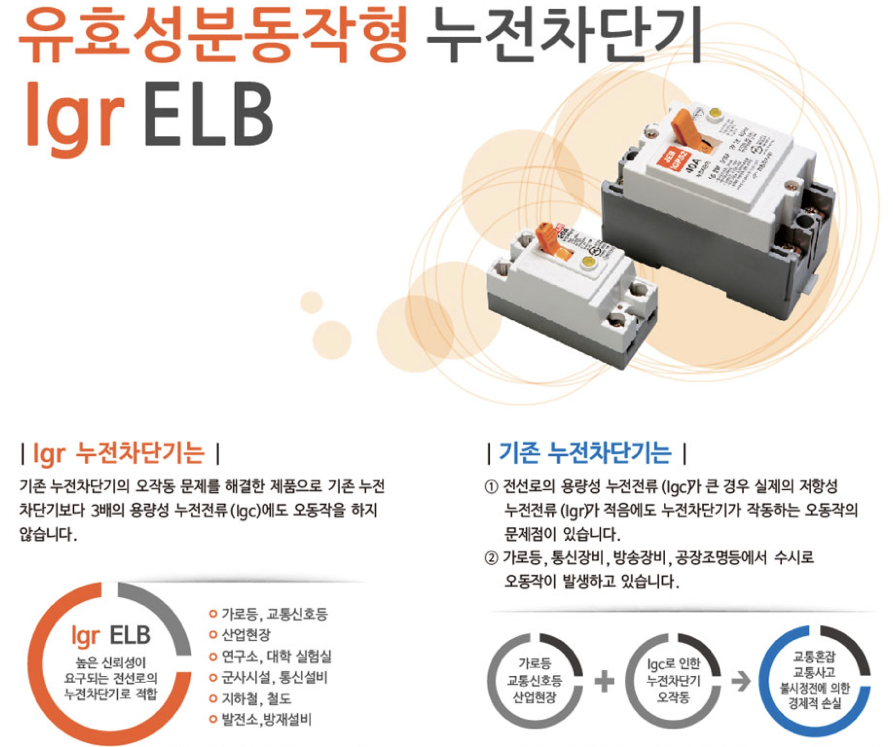

# 누전 검사의 원리, 오류와 오해 - 자주 차단기가 떨어진다는 그대에게

아직도 누전 차단기가 왜 떨어지는지 오해하는 분들이 많아. 

일단, 대부분의 누전 차단기는 정상적인 경우뿐 아니라 오작동으로도 떨어지거든. 근데, 대용량 축전기(커패시터 또는 콘덴서)가 들어가는 전자기기를 많이 사용하는 시대로 접어들면서 후자의 경우도 크게 늘고 있는데, 
아직 시대가 따라가지 못 하는 거야.

무슨 얘기냐면, 과거에 비해 누전 차단기가 오작동으로 떨어지는 경우도 많은데 걍 무조건 누전으로 진단한다는 거지. 그럼 엉뚱한데서 원인을 찾고 멀쩡한 전자기기, 특히 수분이 닿는 전기 포트 같은 걸 마구 버리기도 해. 진짜 원인일 때도 있지만, 요즘은 거의 커패시터가 들어간 회로 탓이야.

간단한 누전 검사의 원리를 이해하셔. 공동 주택에 사는데 자꾸 누전 차단기가 떨어지면 대부분 겁나니까 관리실에 전화하기 마련이야. 그럼 관리실에서 메가 테스터기라는 걸 들고 올 거야. 메가는 원래 메거라는 브랜드 명이야. 근데 다들 걍 피존하세요~ 하듯이 메가라고 굳어진 거고. "메가 테스터기"의 정식 명칭은 "절연 저항
계"인데 거의 안 써. 걍 Megger라는 브랜드명 탓에 메가라고들 해. 현장 용어는 실제 전문 용어랑 다른 경우가 많아.

누전 차단기가 떨어지는 경우는 두가지야. 우리가 겁내는 실제 누전과 콘덴서나 특히 커패시터 같은 축전 소자가 전기를 잔뜩 머금는 정상적인 용량성 누설 전류를 누전으로 오해하는 경우. 전자는 다행인 거고 후자는 골치거리인 거지.

메가 테스터기 원리를 간단히 설명하면 물을 흘려보내서 돌아오는 양을 측정하는 거나 같아. 100의 전기를 흘려보냈는데 80만 돌아오면 누전이라고 판단하는 식이야. 이 마진도 측정하는 사람이 설정하는 거야. 게다가 엄청난 고압을 흘려보내. 그래야 회로 어디서 구멍이 났는지 확인하기 쉬우니까. 

수도관에서 구멍난 곳을 찾는다고 생각해봐. 수압을 세게 흘려야 티가 날 거 아냐. 응, 메가 테스터기도 그런다고. 만볼트씩 흘리기도 하니까. 

그래서 전기의 질에 민감한 고가 장비를 쓰는 사람이면 절대 이런 테스터기를 쓰면 안 돼. 모르는 분들이 와서 걍 만볼트씩 흘려서 망가뜨려도 망가졌는지조차 당시는 알지 못 하거든. 당장 안 망가져도 위험한 짓이야. 배수 파이프를 망치로 때리는 그림을 그려보셔. 멀쩡해보여도 내상을 입는다는 거지.

근데 생각해봐, 배터리가 많은 기기나 무정전 전압장치(UPS) 같은 걸 사용 중이라면 얘네들이 들어오는 전기의 일정량을 머금는다고. 일반 메가 테스터기는 이걸 감지 못 해. 

솔직히, 꽤 오래 전기 일하는 분들을 만나봤지만, 단 한번도 용량성 누설 전류까지 감안하는 테스터기 쓰는 걸 못 봤거든. 응, 우리집 오면 죄다 '누전이네요'라고들 했어. 멀쩡한데도.

더 안타까운 건 이런 정상적인 용량성 누설 전류을 잘못 감지해서 차단기가 떨어지는 건 '용량성 누설 전류 차단기(IGR: Insulation Ground Resistance)'만 설치해도 막을 수 있다는 거야. 게다가 비싸지도 않아. 몇 천원에서 몇 
만원 더 쓰면 땡이야. 그런데도 신축 아파트에서 조차 구형 차단기를 써. 인식이 부족해서 그래.

상식적으로 알아두셔. 한전에서 들어오는 전기는 무한이야. 전기를 이해할 때는 물이랑 비교하면 쉬워. 

P = I x V

이 공식을 단위로 하면...

Wattage = Ampere x Voltage가 되는 거야. 결국...

에너지(일의 양) = 공급된 에너지 원의 양 x 에너지원의 공급 압력

물로 생각하면...

일의 총량 = 단위당 흘리는 물의 양 x 단위당 수압

이거야. 그럼 이해가 쉬울 거야. 전기도 마찬가지야. 220볼트라는 걸 전압이라고 하잖아. 단위당 (가령 시간) 전하를 밀어내는 압력인 거고, 암페어는 단위당 전하의 양인 거야. 이걸 I 라고 하는 건 영어로 intensity 이기 때문이야. 근데 이걸 발견한 사람이 프랑스 사람인 앙페르라서 용어를 찜 당한 것 뿐이야.

그러니까 30A 차단기라면...

30A x 220V = 6600W

순간적으로 6600와트 이상 일을 시키면 떨어지는 차단기란 뜻이야. 간단하게 생각해봐. '니가 설마 6600와트 일을 한꺼번에 한다고? 아닐 거야. 누전일 거야.' 응 그렇게 판단하는 원리야.

간단히 누전 차단기는 보낸 전기와 돌아오는 전기 양이 너무 차이가 날때, 즉 전기가 새고 있다고 판단되면 자동으로 전기를 차단하는 거야. 안전이 최우선이니까. 전자기기가 고장 나거나, 절연이 잘 안 돼서 전기가 새는 경우에도 차단기가 작동하는 거지. 그래서 차단기가 떨어지면 대부분 누전이 원인이라고 생각하기 마련이고. 근데, 내가 정말 순간적으로는 막 30A도 넘어가는 일을 하는 사람이면 어떻게 해야할까? 그럼 차단기 용량을 늘려야 하는 거야. 그게 일상인 거니까. 안 그럼 계속 차단기가 떨어질 거거든.

또, 요즘처럼 커패시터 많이 쓰는 시대라면 정상적인 용량성 누설 전류마저도 누전으로 오판해서 차단기가 떨어진다고. 근데 이 개념이 없으면 불필요한 고생을 하는 거야.

진짜 누전이라면 배수관이 터진 거나 다름 없어서 전기가 그냥 줄줄 새거든. 아까 말했지? 한전은 무한히 전기를 흘린다고. 그걸 막아주는 유일한 안전장치가 차단기인 거라고.

수도관 터지는 걸 그려봐. 물바다되겠지? 전기도 마찬가지야. 차단 밸브를 닫아주지 않으면 걍 줄줄 샌다고.

배전반 안 열어본 분은 모르실 수도 있는데, 차단기는 메인 차단기와 서브 차단기로 구성돼 있어. 에어컨이나 인덕션은 따로 차단기를 설치하기도 하고.

(누전 차단기와 별도로 배선차단기라는 것도 있는데 말그대로 배선용이라 정해진 용량 이상으로 전기가 흐르면 과부하 탓에 끊어지는 역할만 하고 누전은 감지 못 해.) 

하나 더 있어. 집으로 들어오는 외부 배전반에도 외부 차단기가 집집마다 달려 있어. 그러니까 상식적으로 이런 식이야.

50A(외부 차단기) ->40A(내부 메인 차단기) -> 30A, 20A, 20A...(각 서브 차단기들)...

이게 상식적인 수순인데, 만약 이렇게 돼 있다면...

40A -> 50A -> 30A....

넉넉하게 50A 를 메인으로 달았다 해도 순간적인 일의 양이 40A 수준(40x220 = 8800와트)을 넘어가면 어떻게 될까?

응, 외부 차단기가 먼저 떨어져. 그럼 내부에서 아무리 점검을 해봐도 모르는 거야. 그냥 정전인가 싶은 거지. 그럼 진짜 전기 들어오기 마냥 기다릴 수도 있어. 

이게 대형 아파트면 그럴 일이 거의 없는데, 한전이랑 직접 계약하는 거주자가 적은 공동 주택이나 단독 주택이면 외부 차단기도 소유주가 알아서 관리하기 때문에 이런 일이 발생할 수 있어. 특히, 이사가서 리모델링하면서 신경 못 쓰면 이런 일이 벌어져.

그러니까, 다른 건 몰라도, 이건 염두에 두시라고.

- 용량성 누설 전류 감지 차단기를 설치하는 게 무조건 남는 장사다. 기껏해야 몇 만원(차단기가 여러개니까) 차이다.
- 외부->메인->서브 순으로 용량이 같거나 작아지는 구조여야 한다.
- 간단한 전기 상식은 필수적으로 이해하고 있어야 한다.

마지막을 강조하는 이유는, 실제로 세상이 그래. 발전이 더딘 부분이 많아. 언뜻 전기 전문가처럼 보여도 30년된 지식을 그대로 쓰는 분들도 많고. 내가 지금껏 만나 본 전공 중에도 용량성 누설 전류 차단기에 대해 아는 분이 없었어. 장비 자체가 구식이야. 이게 저가든 고가든 의미없어. 메가 테스터기 원리는 거의 같아. 고가라도 '용량성 누설 전류'를 감안 안한 장비면 쓸모 없는 거야. 

시대가 바뀌어도 정말 늦게 따라가는 분야가 있어. 전기도 그래. 전자 분야랑 달라. 전기는 한번 설치하면 몇 년에서 수십년까지 가거든. 차단기 대부분 처음 건물 지었을 때 설치한 거 그대로 쓰는 식이야. 벽안에 심어진 전선들도 굵기와 용량이 다 다른데, 요즘 시대에는 안 맞는 선들이 심어져 있는 실정이니까 말 다했지 뭐. 이게 화재의 원인이 될 수도 있어. 벽에 심어진 전선은 용량 한계가 분명한데 마구 전기 끌어쓰기만 하면 안에서 타버리기도 하거든.

자꾸 차단기가 떨어지거나 누전 때문에 고민하는 분들 참고하셔.

집에 뭔가 충전해서 써야하는 전자기기가 많다 싶으면 용량성 누설 전류도 그만큼 많다는 뜻이야. 특히 UPS 같은 거 쓰면 짤없어.

자꾸 차단기가 떨어지거나 누전 때문에 고민하는 분들 참고하셔.

집에 뭔가 충전해서 써야하는 전자기기가 많다 싶으면 용량성 누설 전류도 그만큼 많다는 뜻이야. 특히 UPS 같은 거 쓰면 짤없어.

