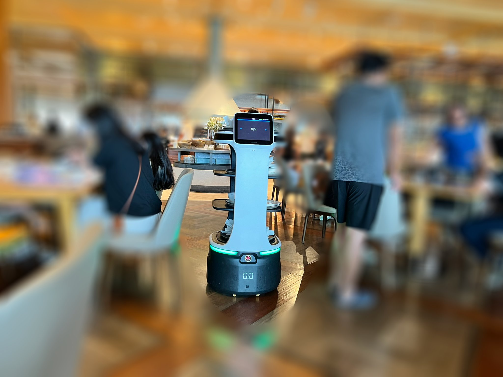

# 로봇, 인공지능과 공존하는 인류의 미래 - 그대의 선택은?

비켜라, 휴먼...

슬그머니 익숙해지는 근미래...

'로봇+인공지능(기타 소프트웨어 2.0)'으로 대체될 세상 만물(무엇을 상상하든 그 이상)을 생각하면 헤아릴 수 없을 정도잖아.

실험해 보셔.

지금 당장 본인이 있는 자리에서 주변을 둘러보고, 뭐가 됐든 (사람 포함) 저런 걸로 대체될 객체(object)들을 찾아봐. 상속받아 다형성 부여해서 대체할 수도 있고, 아예 상속조차 안 받고 버려질 것들도 있을 거야. (근데 개념상으로 보면 전혀 상속 받지 않는 경우는 없어. 주판이 사려졌다고는 하나 그 개념은 상속된 거니까. 또, 엑셀이 처음이자 마지막이라고 생각하면 안 돼. 그 전에 Lotus와 Quattro가 있었듯이 역사를 모르면 중간 과정을 간과하게 돼. 걍 마소가 독점짓을 하면서 죄다 죽여버렸을 뿐이야. 워드나 파워포인트, 엣지 브라우져도 마찬가지야. 그치 빌?)

근데, 상상력이 좋아야 해. 너무 뻔한 것만 보지 마시고. 만화적으로 보셔. 그럼 진짜 많이 보일 거야. 걍 거의 다야. 직업 같은 추상적인 것도 봐야 정상이야.

이 말 잊지 마시라고. 

Every darn thing is an object. 

응, 그러니까 객체지향적으로 사고할 거면 세상만물(tangible or intangible)이 객체여야 하는 거야. 그래서 간단히 직업도 예로 들어드리는 거야. 조낸 많아. 거의 다라고. (어디까지냐면... 응 사랑도 포함돼. 소름끼치지? 근데 현실이야.)

근까, 시나리오는 정해진 거야.

캐스팅도 거의 끝났고. 디테일은 달라질지 몰라도. 큰 그림은 모두가 '기대하고 바라는' 미래를 향하기 마련이니까.

재미있는 건 그 기대와 바람도 정규분포라는 거야. 양극단도 있지만, 평균을 봐야해. 평균적으로 기대하고 바라는 미래인가. '그렇다'면 그쪽으로 갈수밖에 없어. 자본주의 논리로도. 그게 돈 되는 미래라는 뜻이라.

근데 뻘짓해서 하차 또는 하차 당하는 캐스트가 생기면, flag bearer, flag bearer candidate and the rest의 멤버십은 바뀌는 법이고.

상식인데...

이 마저도 정규분포 안 그리는 사람은 '바람으로 변질된 기대'에 배신당하기 십상이야.

내가 왜곡시킨 정규분포가 아니라, 실제로 형성되는 분포를 봐야해. 그래야 오차가 적어.

그럴듯한 시나리오는 그렇게 탄생하는 거니까. 억지부리지 말고, 누구한테 썰을 풀어도, '그럴듯 한데?' 반응이 금세 나올 정도로 신빙성이 커야 해.

장르를 초월하는 호라이즌을 다지라는 이유고. 그래야 더 큰 그림을 더 빠르고 쉽게 볼 수 있으니까.

어찌보면 우리 스스로 인공지능 모형이 하는 짓을 그대로 해야 하는 거야.

'실수->성찰->바로잡음'의 성장 사이클을 평생 유지하면서 경계없는 농밀한 유니버스를 큰 그림으로 보는 능력을 기르는.

그게 사실 인공지능이 궁극적으로 하는 짓이거든. 설계 자체가 그래. 인간이 절대 못 따라갈 부분이 후자인 거고. 

모든 경계를 뛰어넘는 의사, 판사, 변호사, 교사, 아티스트... 응, 얘들한테는 이미 이딴 분류 자체가 의미가 없잖아. 걍 다 배우고 경험한 거나 다름 없으니까. 학습하는 방대한 데이터셋에 이미 다 포함돼 있으니, 경계없는 농밀한 전문성과 경험이. 인간들의 편향까지도 죄다.

여기에 자가수정(self-correction), 자가학습(self-learning) 가능한 AGI로 가는 미래라면?

물리적으로도 인간을 월등히 뛰어넘는 기계에 그 AGI가 탑재된다면?

뻔한 거라고. 어떤 미래일지는.

자기 미래만 달라져. 잊지마셔. 이걸 착각하면 안 돼. 내가 저 미래 안에 있을지, 있다면 어떤 모습일지, 더 중요하게, 그 미래에서 어떤 모습이어야 할지, 그러기 위해서 어떻게 살아야 할지, 응 그 개인적 미래만 달라진다고.

The future is not set. There is no fate but what we make for ourselves.

터미네이터에 나오는 이말을 곡해해서 짱구짓 하면 안 돼. 큰 그림은 온 인류의 정규분포에 따라 움직이는 거고...

개인적 미래만 그대 스스로 바꿀 수 있는 거야. 

흐름을 탈지, 거스를지도 마찬가지고. 난 왜 이걸 거스르려는지 머리털 뽑아가면서 고민해도 이해를 못 하겠지만.

굿럭, 휴먼.

🔗 The Official Domain for My Repo: https://cwkai.net
🔗 The Official Domain for My AI Artworks and Essays: https://creativeworksofknowledge.net
🔗 My Artstation Website: https://neobundy.artstation.com/