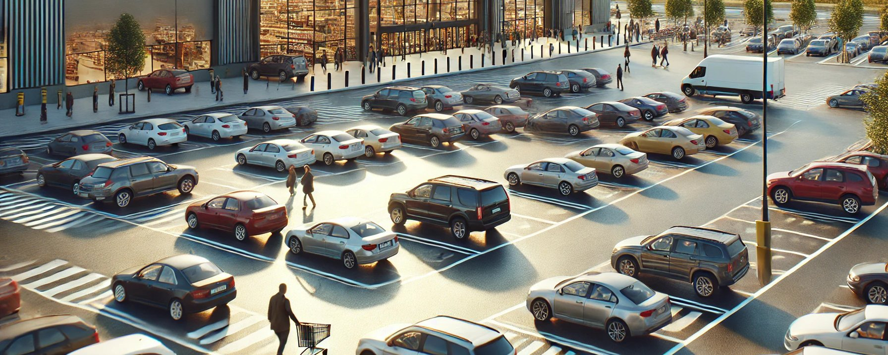

# 마트 주차장, 자율주행, 인공지능 및 인간의 정규분포 - 생활 속에서

상식적인 현상이지만, 이 또한 정규분포라...

아주 작은 마트 주차장이라도 늘 입구쪽에만 차들이 다닥다닥 붙어 있다. 10미터만 더 가도 널널해서 2-3자리가 비어 있고 한방에 주차가 가능한데도 입구 주변을 돌며 기어이 좁은 자리를 찾아 왔다갔다 까다롭고 아슬아슬한 주차를 선택한다.

왜 그럴지는 인지상정이다. 입구쪽에 가까워야 마트에 들어가기도 편하고, 뭔가 들고 나와서 넣기도 편하고...

과연 그럴까...는 의문이다.

차를 세우는 시간도 그렇고, 접촉 사고 리스크로 봐도 그렇고, 아무리 무겁게 들고 나와도 기껏해야 10미터 차이라면, 과연 그럴까...

운전을 하는 사람이든 안 하는 사람이든, 수십년을 한 사람이든 초보운전이든, 그런데도 늘 '왜 입구쪽에 안 세우냐고'들 한다.

그게 central tendency, 중심 경향이고 정규분포로 가면 central limit theorem, 중심극한정리로 향하는 거다.

68% 가까운 '평균+1 표준편차'까지 그런 선택을 하고, 그나마 다른 생각을 하는 표준편차 2 위쪽 사람은 기껏해야 5%, 표준편차 3을 넘어 경계를 초월하는 짱구를 굴리는 건 1%도 안 된다는 뜻이다.

물론, 옳고 그름의 문제도 아니고 일상 속에서는 딱히 의미도 없지만, 이게 습관이면 얘기가 달라진다.

결국 뭘 하든 군중(herd)를 따르는, 은연중에 그게 안전하다 믿는게(false sense of security) 버릇이 되고 군중심리(herd mentality)에 젖어 살기 때문이다.

그걸 경계하자는 것일 뿐, 누굴 탓할 생각은 없다.

아마, 인공지능에 맡기면 (자율주행처럼) 찰나에 가장 합리적인 선택을 할 거다. 어차피 리스크도 적을 테고.

차들끼리 네트워킹까지 한다면 한결 원활해진다. 그런데도 '자율주행' 차보다 인간이 더 안전하다는 짱구같은 소릴 하는 현실 역시 정규분포일 뿐이다. 인간은 영원히 그 정규분포가 달라지지 않는다. 

'실수->성찰->바로잡음' 성장 사이클을 무한대로 반복하며 경계를 뛰어넘어 24/7 성장하는 인공지능은 그 분포마저 인간을 초월한다. 잊지 마시라. 존재하는 유니버스 자체가 다르다는 뜻이다. 한 정규분포 안에 넣어 인공지능과 인간을 비교하면 큰 오산이다. 

인간의 신체적/지능적 진화 속도와 인공지능과 로봇의 하드웨어적/소프트웨어적 진화 속도 및 그 가능성(포텐)을 비교해보면 더 등골이 오싹해야 한다.

믿거나 말거나...
ps. 솔직히 가장 안타까운 건...  이 정규분포 평균에 속한 사람들이 아이들의 미래를 좌우한다는 거야. 안티 인공지능 러다이트 사고방식까지 가진 분들이 자녀나 학생들 미래에 적극적으로 개입하는데, 들여다보면 아는 게 거의 없이 그냥 싫은 거야. 대체되는 게.  적어도 여러분은 그러지 마셔. 위험해 진짜. 본인에게나 주변에나, 특히 자녀나 학생이라면. 자칫 선의로도 죄짓는 거야. 그나마 아이들이 현명해서 그 영향권을 벗어날 수 있다면 좋은데...  현실이 또 꼭 그렇지만은 않아. 그림쪽만 봐도 알아. 샘플링이니까. 안타까워.
오해마셔. 내 나이가 있으니까 '아이들'이라고 하는 거지... 대학원생들도 나한테는 아이들이야. 30대라도 마찬가지고... 근데 그게 현실이라고.  자기가 공부해서 깨닫고 판단하지 않으면 뭐든 오판의 리스크가 따르는 법이야. 내가 내린 판단이면 그나마 성찰의 기회라도 삼지. 그게 남의 판단이면 억울한 거라고...

🔗 The Official Domain for My Repo: https://cwkai.net
🔗 The Official Domain for My AI Artworks and Essays: https://creativeworksofknowledge.net
🔗 My Artstation Website: https://neobundy.artstation.com/