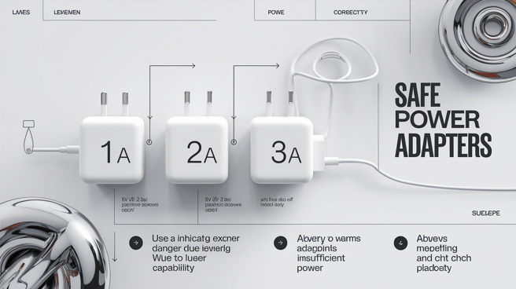

# 전원 어댑터 간단 상식 - 5V 2A 기기면 5V 1A 또는 3A 어댑터 중 어디가 더 위험할까?

오늘 창고 정리할 일이 생겨서 기기, 장비랑 어댑터들을 뒤졌네요.

근데 원래 기기 챙겨둘때 어댑터를 꼭 묶어두는데 딱 한 녀석은 도무지 못 찾겠는 거야. 사실 어댑터는 범용을 구할 수 있어서 큰 문제가 없는데, 이쪽 상식이 부족하면, 응, 불도 날 수 있으니까. 그럴 때 어댑터를 다른 분이 구매해야 하는 경우면 꼭 당부를 하거든.

겸사겸사 알아두시라고.

간단해, 가령 5V 2A (대부분 USB 기기는 1A, 2A면 일 좀 한 단 얘기고, 3A면 엄청 열심히 일아는 애...)라고 써 있는 기기인데 집에 하필 5V 2A랑 3A 어댑터가 뒹굴고 있다고 생각해 보셔. 참고로 5V 2A~3A 라고 써 있는 기기도 있어. 이런 경우는 2A면 대부분 기능이 작동하고 내장 WIFI 모듈을 돌리려면 3A 어댑터가 필요하다...뭐 그런 거야. 가령 엘가토 네오 조명 같은 게 그래. 그냥 컴퓨터 USB 포트에 꽂아도 불은 들어와. 근데 컴퓨터는 대부분 2A USB 포트가 맥스라서 3A면 따로 어댑터를 써야 해. 응, 이 기기는 3A 아니면 와이파이 작동 안해. 그걸 모르면 죽어라 고생만 해, 죽은 와이파이 모듈 붙잡고.

먼저 볼트는 무조건 맞춰야해. 5V면 5V. 다른 거 쓰면 절대 안 되는 거고. 물에 비유하면 전압은 수압이라고 했잖아. 그래서 맞춰야 하는 거야. 암페어(전하의 양/물의 양)만 헷갈리는 거야.

5V 2A 기기일 때 3A 어댑터를 쓰면 넉넉하게 남아돌기 때문에 딱 필요한 만큼만 뽑아써. 이 점이 중요해. 기기는 써 있는 만큼만 전하를 빨아먹어. 물론, 제대로 만든 기기라는 전제로. 2A면 더 줘도 단위당 2A만 먹는다는 거야. 식탐을 부리지 않아.

근데 1A 어댑터면 어떻게 될까? 응, 모자라서 배가 고프겠지? 응, 그래서 더 달라고 수도꼭지에 입을 대고 물을 빨아대듯이 떼를 쓰게 돼. 그럼 1A 어댑터에 발열이 생기기도 하고, 떼를 쓰느라 기기에도 무리가 가게 돼 있어. 그래서 고장이 나거나 불이 나기도 해. 어댑터가 아작나면서.

이게 언뜻 직관적이질 않잖아. 직관이랑 반대라고. 왠지 5V 1A 어댑터가 더 안전할 거 같거든. 아니야,반대야. 3A 어댑터가 더 안전한 거야. 다시, 잘 만든 기기들은 딱 써져 있는 표준을 지켜서 더 부어줘도 먹을만큼만 먹는 애들이라고. 근데 모자라면 안 되는 거야. 이것만 잊지 않으면 돼.

특히, 오디오 관련 기기면 그냥 딱 맞는 어댑터 쓰는게 최고야. 모든 기기는 적정량의 전류가 흘러야 안전하고 오래가는 거야. 오래 꺼두면 기기는 오히려 망가져. 물 안 흘려보내는 배수관이 녹슬듯이. 

또, 어댑터 대부분이 +/- 구분이 있어. 대부분 한쪽을 쓰는데, 유독 오디오 장비에 -/+ 반대로 돼 있는 기기와 어댑터가 있으니까 아무렇게나 꽂으면 안 돼. 극성도 확인해야 해. 극성에서 유난 떠는 어댑터는 역시 잘 만든 녀석이면 주황색 같은 걸로 표시가 돼 있어. 

극성이 바뀌면 어떻게 될까? 전원이 안 들어오거나, 출력이 약하거나, 엉뚱한 짓을 하거나... 뭐 오작동하는 거야.

하다못해, 스피커도 +/- 가 있어. 근데 이걸 거꾸로 연결해도 소리는 나와. 출력이 이상해져서 최대 출력에 문제가 생기거나 그럴 뿐이야. 가령, 홈씨어터에 스피커를 반대로 연결했는데 고출력 영화 장면에서 느닷없이 앰프가 꺼지기도 해. 극성 잘못 연결된 스피커 탓에 앰프가 탈 수도 있거든. 그걸 방지하는 안전 장치야. 역시 잘만든 앰프는 이런 극성 오류도 셋업에서 잡아낼 수 있어. 

쬐끔만 더 자세히 얘기하면, 극성이 바뀌면 스피커 혼이 반대로 움직여. 그 극성에 따라 공기분자를 때리거든. 근데 반대로 움직이면 어느 주파수 대역이든 캔슬될 거야. 그래서 소리가 제대로 안 들릴 수밖에 없어. 극성 잘못 연결된 홈씨어터 시스템은, 응, 노캔 짓을 하는 거야 어디선가.

전기든 전자든 알고 써야 안전해. 안전뿐 아니라 잘못쓰면 특히 오디오 장비는 뻘짓이야. 

전기와 전자를 헷갈리기도 하는데. 다 그런 건 아니지만 대체로 전기와 전자는 장르가 달라. 전기 설비라고 많이 쓰고, 전자 장비라고 많이 쓰는 이유야. 전기는 한번 설치하면 오래 가는 애들이야. 전자 장비는 나머지 대부분이고. 벽 콘센트에서 전기를 뽑아서 파워케이블로 연결되는 단자까지는 전기고, 교류(AC)인 거야. 특별한 이유가 없는 한 전자 장비 안으로 전기가 들어가면 직류(DC)회로로 바뀌어. 전하의 흐름이 바뀌면 안 되니까. 또, 회로에 들어오자 마자 대부분 전압을 팍 낮춰. 예외적인 경우도 있는데 오디오 장비 중에 이런 예외가 많아. 앰프 같은 애들. 진공관 앰프 같은 건 AC->DC->AC->DC 뭐 이런 짓을 해. 그러면서 소리를 다듬는 거라. 전자 장비는 누가 일을 하는 걸까? 응 전자가 해. 그 전자의 흐름을 이런 저런 소자를 사용해서 제어하는 게 전자회로인 거고, 그 회로를 인쇄하고 땜질하면 기판인 거고, 그걸 조낸 압축하면 직접회로인 거고 뭐 그런 식이야. 걍, 일은 전자가 한다는 것만 잊지 마셔. 근데, 인간은 전자를 아직 잘 이해 못해. 걍 결과만 알고 쓰는 거야.  

여러분 대부분 사용하는 전자장비는 죄다 DC회로라고 생각하면 크게 틀리지 않아. 

길어진다. 어댑터 팁만 쓰겠다고 했는데... 뭐, 그렇다고.

홈씨어터 관심 있는 분들도 많아지니까, 이 부분만 덧붙일게. 실제로 스피커 극성 잘못 연결하는 분들이 의외로 많아. 내가 만나본 전기 전문가 중에서도 스피커에 극성이 있다는 걸 모르는 분이 있었을 정도야. 빨간 게 +야. 검정이 -고. 언뜻 빨강이라 마이너스일 것 같지? 반대야. 역시 잘만든 녀석들은 다 써 있어 +/-라고.

그리고 스피커는 둘로 나뉘어. 패시브와 액티브. 액티브는 앰프를 품고 있는 애들이란 뜻이라, 홈씨어터에는 안 써. A/V 리시버가 앰프 역할을 하고 거기에 패시브 스피커 세트를 연결하는 거니까. 서브우퍼는 좀 달라. 액티브 앰프 연결돼서 따로 쓰는 경우가 대부분이야. 이럴 땐 리시버쪽에서 앰프 역할을 안 할 뿐이야.

근데 앞서 언급했듯이 극성을 잘못 연결해도 소리는 나와. 단, 혼(스피커에서 뽈록 튀어나온 부분)이 반대로 움직인다고. 가령, 좌우 프론트 스피커 중 왼쪽 스피커의 극성이 잘못 연결돼 있다면 어떻게 될까? 응, 좌우 소리는 나오는데, 공기분자를 반대로 때리기 때문에 좌쪽에서 우쪽에 노이즈캔슬링 짓을 하게 된다고. 시차가 있고, 공간이 있기 때문에 완전히 사라지진 않지만 소리가 엉망이라는 거야. 대부분 막귀라서 못 알아챌 뿐이야. 그냥 소리가 떡이 돼. 

근데 홈씨어터는 또 여러대 스피커를 연결하잖아. 11.1 애트모스 뭐 이런 12대 이상 스피커 쓰는 시스템 설치하고 극성 바뀐 애들이 곳곳에 있어봐. 응, 그래도 소리는 난다고. 근데 걍 노캔짓을 하기 때문에 좋은 소리가 날 수가 없는 거야.

참고로, 소리 파동성 얘기할때 언급했듯이 서브우퍼 (.1채널)는 방향성이 없어서 반대로 설치한다고 했잖아. 내가 앉을 자리에 서브우퍼를 두고 잘 들리는 곳을 찾아서 그곳에 설치한다고. 응, 이건 이상적인 거고 그렇게 설치하면 아마 이혼해야 할 거야. 그러니까 적당히 타협해야 해. 서브우퍼는 가정집이면 절대 이상적인 곳에 설치 못해. 아예 홈씨어터 공간을 따로 떼어놓지 않는 한. 

뭐든 파고들면 더 재밌는 거야. 몰라도 되긴 하지만, 낭비가 심해. 진짜 많이 봤어. 이렇게 그냥 쓰는 분들. 그러면서 쓸데없이 케이블만 조낸 비싼 걸 써... 케이블은 배관일 뿐인데, 아무리 설명해도 죽어라 우겨. 디지털 개념도 없으면서 전자의 질이 달라진다는 소리까지 해. 난 아직도 무슨 말인지 모르겠어. 전자의 질이라는 게... 🤣

아참, 빨강/검정 구분 못해서 극성이 바뀌는 경우는 거의 없어. 고가 케이블일수록 이놈의 색깔을 이상하게 꼬아놔서 헷갈리기 때문이야. 빨강,검정으로 나뉜게 아니라... 케이블 사보시면 알아...
