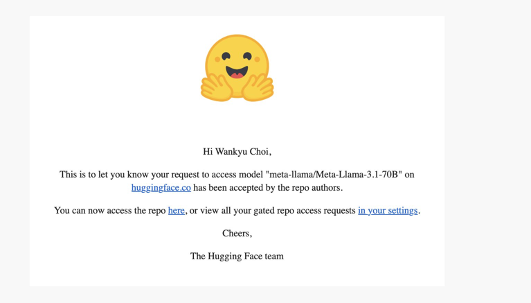
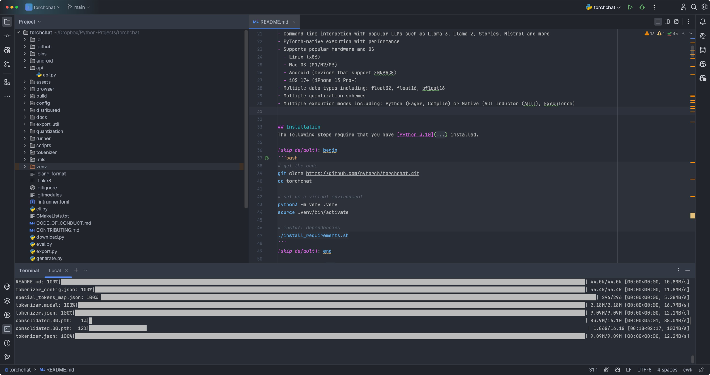
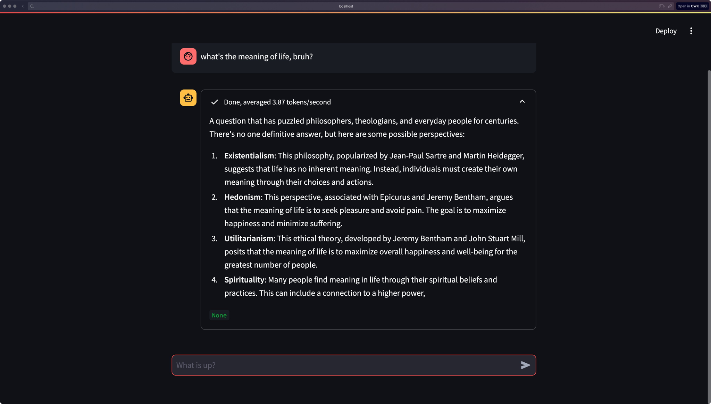

# How to Run LLMs Locally with Meta's Torchchat

로컬 머신(데스크톱, 랩탑, 모바일 기기 등)에서 간단히 LLM 돌리기. Python 알면 좋지만, torchchat 은 아예 코딩 없이 사용 가능합니다. 

The official repo: https://github.com/pytorch/torchchat

## 1. Clone the Repository: Start by cloning the Torchchat repository:
   ```
   git clone https://github.com/pytorch/torchchat
   ```
   After cloning, navigate into the directory and follow the instructions in the `http://README.md` file.

## 2. Obtain Your Access Token from Hugging Face:
   - If you don’t have a Hugging Face account, create one.
   - Once logged in, generate an access token. This token is essential for downloading models and is a one-time setup, so keep it secure. If lost, you can always generate a new one.
   - The token is required only for logging in, so you'll use it primarily when interacting with Hugging Face-hosted models.

## 3. Request Model Approval:
   - For each model you wish to download, you’ll need to request approval. This process might seem cumbersome, but it's necessary.
   - For instance, if you try to run `python3 http://torchchat.py chat llama3.1`, you may encounter an error indicating that you lack access. Click the provided link to request approval.
   - After submitting your request, wait for approval, which will be communicated via email.
   - Once approved, you can run the command again to download and use the model.

## 4. Running the Model:
   - To interact with the model, use a command like:
     ```
     python3 http://torchchat.py chat llama3.1
     ```
   - Additionally, you can create a web UI with Streamlit to chat with the model. However, if you encounter the error `AttributeError: module ‘streamlit’ has no attribute ‘write_stream’`, this indicates that your Streamlit package is outdated.
   - To fix this issue, update Streamlit to version 1.3.1 or higher by running:
     ```
     pip install streamlit --upgrade
     ```

And there you have it! You're all set to explore the world of large language models and perhaps even uncover the meaning of life.





