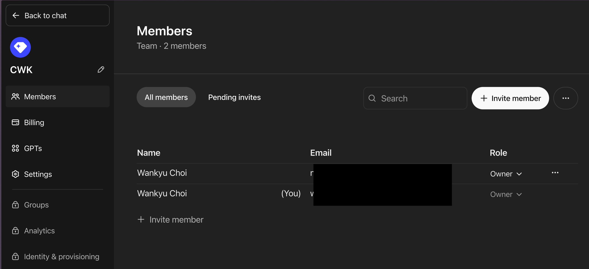

# 대기업 A/S 프로세스와 LLM 스케일링

이럴 때 패턴 인식 연습하시는 거야. 어차피 똑같아. 패턴은...

대기업에서 레벨별로 엔지니어 피라미드를 만들고 명장은 꼭 필요할 때만 파견하는 프로세스라고 했잖아.

ChatGPT나 Claude 같은 LLM 모형 서비스할 때(뿐 아니라 모든 다른 온라인 서비스도 마찬가지)도 이런 스케일링을 한답니다. 

최적화에 목숨 거는 컴쟁이가 신경 쓰는 3대 개념이 뭐다?  재활용성(reusability), 확장성(extensibility), 유연성(scalability). 그 중 유연한 대응에 해당해.

LLM도 별 시덥지 않은 질문에까지 인퍼런스 compute 를 총동원하진 않는다는 거야. 하다못해 (추측이지만 그럴 수밖에 없어) 모형 자체가 일반인이 사용하면 퀀타이즈된 정밀도 떨어지는 모형일 거야. 같은 GPT4-o나 Sonnet 3.5 라고 해도 정밀도가 다른 저사양 모형을 돌린다는 거지. 기업 고객이면? 응, 정밀도 높은 애들 돌려주는 거고. 안 그러고 개나소나 다 최고 사양으로 돌리면 버벅대기 십상이고 아마 이 기업들 망할 거야. 

그래서 LLM 서비스를 무료로 쓰지 말라는 거야. 저사양 모형만 주야장천 돌려보고 별로라는 분들이 실제로 많거든.

정말 중요한 작업을 해야 한다면 기업고객 플랜을 선택하는 게 나을 수도 있어. 

내가 OpenAI 에서도 팀 플랜을 쓰는 이유고. 다른 서비스는 최소한 프로급을 쓰는 이유야. 그럼 적어도 너무 떨어지는 정밀도 서비스를 받을 리스크는 많이 줄어들거든.

실제로 팀 플랜 쓴 이후 ChatGPT 토큰 리밋에 걸려본 적도 없고. 어차피 계정도 2개 이상 주기 때문에.

세상은 패턴이야. 하나를 보면 열을 안다...는 옛 어른말 그른 거 하나 없고, 모든 통찰은 이미 속담에 있다고 했잖아.

그냥 통계 샘플링 패턴인 거고, 객체지향적으로 따지면? 응, 객체 인스턴스 사례들일 뿐이야. 거푸집 클래스 끄집어내면? 응, scalability로 추상화되는 거고.

어떤 치트키든 그렇게 연습하시라고. 그러려면 프레임을 무너뜨려야 해. 매번 강조하지만.

블랙스완 후보라면 해보셔. 이 세상에 널려 있어 스케일링 인스턴스 패턴은.

