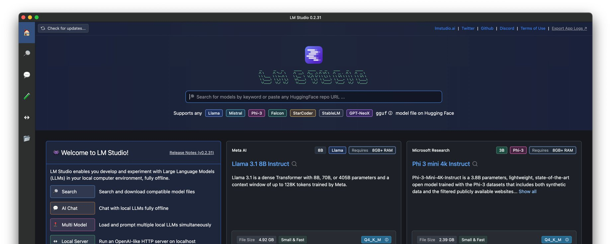
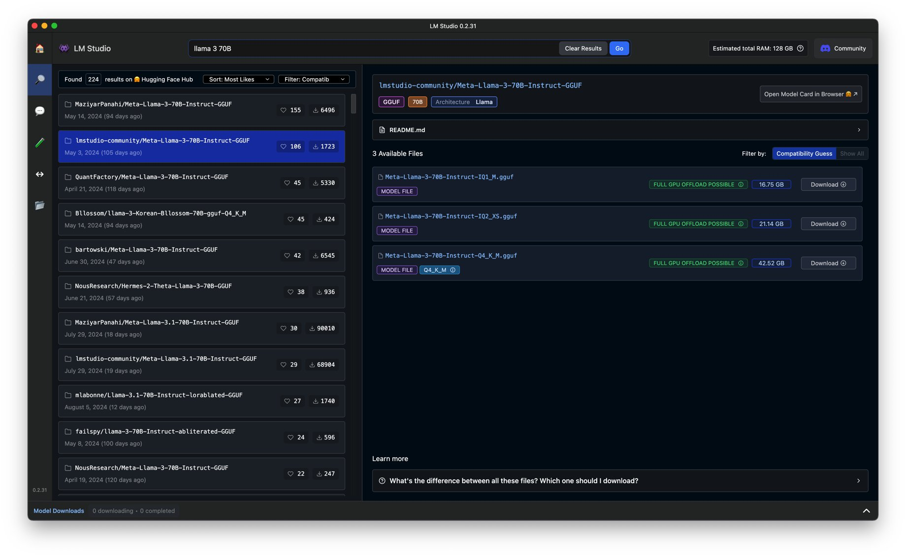
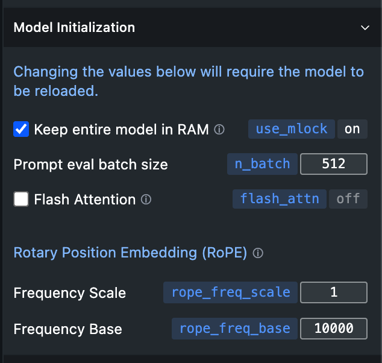

오픈소스 LLM 가장 쉽게 (노코딩) 로컬 머신에서 돌려보기

LMSTUDIO: https://lmstudio.ai

윈도우, 리눅스, 맥 모두 사용 가능.

오픈소스 무료. 허깅페이스 자동 연동 및 검색 가능. 채팅 가능. 프리셋 저장 가능 기타 등등.

가령 Llama 3.1 70B 라고 검색하면 (405B는 검색 가능해도 로컬로 돌리는 건 워낙 커서 거의 불가능) 파인튠드 모델까지 모두 나옴. 

이중 가급적 검증된 사용자(모델을 파인튜닝한 사용자를 가리킴. 예:The Bloke) 위주로 다운로드 받아 쓰는 걸 추천. Censoring 여부도 확인 가능. Censored 모델을 safety 레이어 걷어내고 파인튜닝 해서 uncensored로 바꾼 모형도 있음.

과거에는 다른 포맷도 있었지만 지금은 거의 GGUF 포맷. 익숙해질 것.

동일 모형이라도 quantization (정밀도를 포기하는 모형 압축 기법)에 따라 크기가 다름. Q4면 4bit quantized Q1이면 1bit quantized 식.

이전 아티클에서도 강조했지만 70B라는 건 파라메타 개수이지 용량이 아님.

70B x 4 bytes = 280GB

Full precision이면 70B 모형 돌리는데 최소 280GB GPU RAM이 필요하다는 뜻. 

70B x 2 bytes = 180GB

70B x 1 byte = 70GB

70B x 1/2 byte (4bit) = 35GB

단순 계산하면 대강의 크기가 이렇다는 뜻이고, 실제로는 파일 포맷 탓에 살짝 더 큼. Quantization 기법도 다양하기 때문에 정확한 수치는 암산 불가.

게다가 본인 GPU VRAM이 받쳐준다해도 오버헤드 감안해야 하니 20~30% 여유는 항상 감안할 것. 자칫 컴퓨터 먹통 됨.

그러니까 스샷 보면 내가 지금 쓰는 M3 Max 가 128GB 메모리이기 때문에(애플 실리콘 통합 메모리), 43GB 용량의 70B Q4 모형 정도는 가볍게 FULL GPU OFFLOAD POSSIBLE 이라고 뜨는 거고, 애매하다거나 어렵다고 뜨면 Metal Only(애플 GPU로 몽땅 올리겠다는 뜻)로 돌리면 위험할 수도 있다는 뜻. GPU 부족할 때 CPU랑 자동으로 나눠쓰는데 그럼 버벅대기 때문에 거의 못 쓸 수준.  
애플 실리콘의 경우 간단히 본인 통합 메모리의 70%만 감안하셔.  
128GB x 0.7 = 89.6GB  
이 안쪽으로만 안전하다 생각해서 모형 돌리시라고.  
오픈소스 uncensored LLM 모형들 돌려보며 친근해질 수 있는 가장 간단한 방법이니 참고하세요.

🔗 The Official Domain for My Repo: https://cwkai.net
🔗 The Official Domain for My AI Artworks and Essays: https://creativeworksofknowledge.net
🔗 My Artstation Website: https://neobundy.artstation.com/