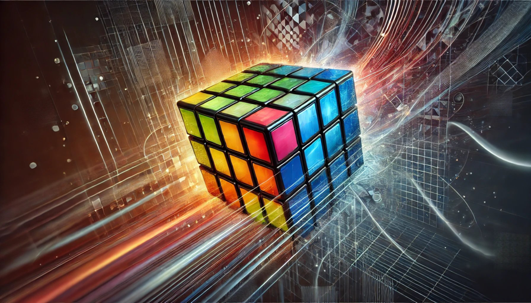

# 인공지능 정부 규제 리스크와 투자, 그리고 루빅스 큐브 프레임

말이든 글이든 문맥 파악이 중요하잖아. 문맥이 틀어지면 어떤 말이나 글도 독이 될 수 있어. 초점이 흐려진 이미지나 다름 없으니까.

프레임도 마찬가지야. 언뜻 당연한 프레임이라 하더라도 그 프레임에 사고를 가둬두면 그 또한 독이 될 수 있는 거야.

간단하게 생각해봐. 큰 그림의 일부인 퍼즐 조각 하나가 있어. 근데 그 안에서 그게 세상 전부인양 사고하는 개구리가 있다면, 우린 그걸 우물안 개구리라고 하잖아.

세상 어떤 프레임도 완전하지 않거든. 그 어떤 프레임도 전체의 일부일 뿐이니까. 그걸 벗어난다고 해도 사고가 완전히 자유로워지는 건 아니라는 뜻이야. 또 다른 외곽 프레임에 갇힐 리스크는 여전하니까. 그래서 줌인아웃이 자유로워야 한다는 거지. 그러려면 호라이즌이 넓어야 해. 여러 도메인에서 경험치를 쌓을수록 자유도가 높아지니까. 그래도 100% 완벽한 프레임은 존재할 수 없어. 중첩된 프레임은 무한대니까. 게다가 실제 세상은 그대가 착각하듯 2D 평면 그림이 아니잖아. 수십, 수백차원 벡터가 무한히 포개져 있는데 인간의 한계로 기껏해야 2D나 3D로 볼 뿐이니까. 근데 그 2D 그림조차 편협하게 본다면 얼마나 작은 세상을 보는 거겠어. 

직전에 포스트했던 인공지능 규제 리스크도 그냥 더 큰 그림의 퍼즐 조각일 뿐이야. 여기서 그칠 수도 있고, 주변 퍼즐 조각도 더해서 좀 더 큰 그림을 그려볼 수도 있고, 아예 과격하게 다른 조각에 끼워맞춰서 다른 그림을 그려볼 수도 있는 거야. 내가 프레임을 벗어나려 애쓸 때 과격해져보라는 이유야. 검색엔진에서 연관 검색어 띄우는 식의 유연성만으로는 부족하거든. 

응, 루빅스 큐브를 돌린다고 생각해봐. 적어도 그 수준까지는 프레임 자유도를 높여야 해. 2D를 넘어 3D까지 넘보는 거지. 과격해지라는 건 이런 의미야.

프레임을 벗어나는 사람들의 정규분포를 그려봐. 2D 그림 조각 맞추기 정도는 평균이라는 거야. 아웃라이어쪽으로 가고 싶으면 더 과격하게 벗어나서 루빅스 큐브 정도는 맞추고 살아야 하는 거지. 그럴수록 도메인을 넘나드는 넓은 호라이즌이 도움이 되는 거고.

규제 리스크를 이해하려면 '규제'를 하는 이유부터 고민해야돼. 인공지능의 경우는 크게 보면 역시나 역사적 상속성 패턴 중 하나인 미지에 대한 공포(Fear of the Unknown)
템플릿의 반복일 뿐이고. 아직도 블러드본 안 해봤으면, 크게 삘 안 올 거야. 이 템플릿을 소름끼치게 잘 풀어주면서도 과격한 프레임 전환까지 덤으로 선물해주는 게임이라니까.

응, 인류는 늘 미지의 것에 대한 공포를 느껴왔어. 근데 미지의 것이 대단할수록 공포의 크기도 커지기 마련이야. 그런 미지의 것에 직면하면 인간은 대체로 4가지 길 중 하나를 선택해. 공포, 경외, 동경 그리고 융합. 

지금 대부분 느끼는 건 공포야. 신이라는 존재를 만들어낼 때도 일단 공포에서 시작하고, 그 공포를 바탕으로 경외로 이어지기 때문에 신을 숭배하는 단계에 이르는 거야. 그런데 동경하는 부류가 생기면 신과 함께하겠다며 바벨탑을 세우려들지. 더 나아가 신과 하나가 되겠다며 융합하려는 이들까지 생겨나.

인공지능도 다르지 않아. 인공지능 전문가라고해서 인공지능 다 이해 못한다고 했잖아. 딥러닝도 대충 이론과 결과만 아는 거야. 실제로 인공지능이 신경망 안에서 진짜 뭘 학습하고 어떻게 추론하는지는 100% 이해하지 못해. 그래서 무서워하는 세력이 생겨난 거야. 제프리 힌튼 같은 인공지능 대부 중 한 명도 식겁해서 규제하자는 쪽에 서게 된 거고.

최근에는 일론 머스크마저 규제 법안에 찬성하는 뜻을 비쳐서 오픈소스 커뮤니티까지 놀라게 했잖아. 

근데, 사실 예상 가능한 일이야. 왜냐하면, 이들만큼 인공지능이 얼마나 무서운 단계로 발전하고 있는지 잘 아는 천재들도 없거든. 다시 말해, 그만큼 인공지능의 미래 성장 곡선 기울기가 가팔르다는 반증일 뿐이야. 그래서 무서운 거니까.

그러면서도 결국 공포, 경외, 동경, 융합 또는 여기서 상속받은 다른 다형성의 형태로 인공지능과 공존하는 미래로 나아갈 수밖에 없는 거야. 이미 터진 물꼬를 막을 수는 없거든. 도도히 흐르는 역사의 급류에 어떻게 대처하느냐 차이일 뿐이라는 거지.

'구더기 무서워서 장 못 담그나'라는 한국 속담이 딱 어울리는 상황이야. 구더기를 처음 봐서 기겁할 뿐인 거고, 어차피 구더기를 완전히 제거할 수는 없는 거라 그냥 공존하는 방향으로 가게 돼 있어. 그러다보면 구더기가 얼마나 미미한 존재인지 알게 되니까. 익숙해지고. 생각해봐, 뭔가 기술 혁명이 일어나면 늘 부작용 우려하고 범죄 걱정하고 그랬잖아. 근데 오랜 세월이 흐른 지금도 100% 뿌리뽑은 건 아니라고. 그냥 구더기는 구더기로 남아있을 뿐인 거지. 또, 갈수록 그 수와 폐해도 줄기 마련이야. 물론, 인류가 바른 길을 간다는 전제로.

인간의 사고 역시 정규분포이고, 인류 평균을 주도하는 레알 천재급 리더들이라 해도 정규분포는 만들어져. 현재 어떤 부류가 컨센서스를 이루느냐에 따라 중단기 부침이 생기긴 해도 거대한 장기이동평균선의 기울기가 크게 달라지진 않는다는 거야.

잊지 마셔. 규제 리스크가 커지니 인공지능 발전에 제동이 걸릴지도 모른다는 식으로 단순 해석해서 없어질 직업에도 여유가 생기는 거 아니냐 오해하지 마시라고. 영향을 미친다해도 대세에는 큰 변화가 없다는 거야. 이미 200킬로미터로 달리던 트럭에 치일 수 밖에 없는 느린 속도로 움직이는 사물이 있다면 그 트럭이 조금 속도를 줄인다고 해서 화를 면하기 어렵다는 거야. 모멘텀이라는 게 있기 때문에. 그러니 엉뚱한 오판은 하지 마시라고.

미국만의 얘기라거나 규제탓에 국가간 경쟁에서 미국이 밀릴 거라거나, 응, 이런 생각도 퍼즐 조각 한 두개만 보는 거야. 

규제 리스크는 어차피 만국 공통이야. 미국이 두려워하는 걸 다른 나라라고 두려워하지 않는다고 생각하면 그 또한 편협한 시각인 거야. 인공지능이 인류 전체에 주는 위기감과, 국가 권력에 주는 위기감이 크게 다르지 않다는 뜻이야. 규제는 그 권력을 쥔 당국에서 하는 거니까. 어느 나라도 무검열 인공지능이 판치는 세상은 달가워하지 않을 거거든. 특히, 민주 국가가 아니라면 더 그래. 그런데도 미국과 중국의 주도권 싸움이라는 프레임에 갇히면 또 편협한 해석만 하게 된다고. 크게 보라니까. 미국이 규제하잖아? 그럼 중국도 따라할 수밖에 없어. 아니, 다른 모든 나라가 동참할 거야. 딥러닝의 발상지가 미국이야. 거기서 두렵다는데 다른 나라가 뭘 보고 안심하겠냐는 거야.

한가지 더 프레임을 벗어나봐. 응, '윤리가 100% 적용되는' 프레임에서만 보면 현실이 제대로 안 보일 거야. 이 모든 변수에서 '윤리'를 제거하면 또 다른 프레임이 열려. 특히, 정치판, 전장, 금융시장이라는 윤리가 존재하기 어려운 암흑의 숲에서는. 이 얘긴 이미 했으니까 넘어갈게. 

다시 강조하지만, 제프리 힌튼이나 일론 머스크까지 두려워하는 걸 가볍게 보지 말라고. 진짜 무서워서 무섭다고 하는 레알 천재들이니까. 레알 천재급이면 일단 '선의'를 인정해줘야해. Benefit of the doubt 여야 한다고. 

근데 암흑의 숲이라면 얘기가 달라져.

그럼 한발 더 나아가봐.

규제 리스크를 가장 민감하게 느끼는 곳이 시장이야. 

시장은 선진국일수록 성장주가 주도하는 법이야. 성장주는 기본적으로 그 성장성 덕분에 프리미엄을 받는 기업이야. 지금까지 실적은 사실 아무 의미가 없어. 과거 성적표일 뿐, 성장주에서 중요한 건 미래 성장성이고, 적어도 3년은 성장성이 꺾이지 않아야 인정을 받아. 왜냐고? 그냥 컨센서스야. 기업 분석 애널리스트들의 평균 추정치가 3년이야. 그 이상은 인정을 못 받아, 점치는 거니까. 애널리스트들이 배우고 활용하는 템플릿이 평균 3년짜리라는 거야. 그게 시장 전반에 영향을 줄 수밖에 없어.

이런 애널리스트들이 목표주가를 낼 때 얘기하는 기간은 밸류에이션 추정 타임라인과는 달라. 3년 추정을 하더라도 목표주가는 6개월짜리를 낼 수도 있거든. 그러면서 주기적으로 성장성 밸류에이션 수치들을 수정해서 다시 수정 목표주가를 발표할 뿐이야. 애널리스트들이 발표하는 주가대로 움직이지 않는 데 무슨 소리냐 할 수도 있는데, 그건 통계 마인드가 없다는 뜻이야. 이들의 목표주가를 보라는 게 아니고 통계적 대표성을 보라는 거야. 성장성 프리미엄을 조절해야 하는 이벤트가 발생하면 이들이 대표하는 다른 투자자들도 그럴 가능성이 높다는 뜻이라고. 

버핏의 움직임이 왜 중요하다고? 버핏의 대표성 때문이야. 버핏이 그렇게 움직일때 보이지 않는 다른 버핏들은 어떤 전략을 유지할 건가. 그게 보이거든. 어차피 이들 또한 따로 정규분포가 만들어지니까, 그걸 유추할 수 있는 어마무시한 샘플 데이터 포인트니까.

그래서 통계하라는 거야. 통계를 공부만하고 실생활에서 훈련을 안 하면 이런 단순한 통계 상식마저 잊고 살아.

또, 대부분 미래 시나리오를 가중평균해서 발표하는 게 상식이야. 가능성이 큰 시나리오부터 적은 시나리오까지 두루 가중평균해서 목표주가를 계산하는 게 요즘 트렌드야. 

그럼 인정해야 해. 선진국 시장은 성장주가 주도하고 성장주는 미래 성장성에 따라 프리미엄을 미리 받는 기업인데 성장성에 제동이 걸릴듯하면 최소한 추가 프리미엄을 받기는 힘들다는 거야.

장기 투자의 기본 대전제는 '시장은 우여곡절이 있더라도 장기 우상향한다'여야 해. 근데 장기라는 타임라인이 문제거든. 저마다 그 기간 개념이 달라지니까.

성장성에 제동이 걸릴 거란 의심이 들기 시작하면 누군가는 지금까지 가중평균 시나리오를 조절할 거야. 경우의 수를 따져보고 가중치를 둔 다음 상황이 바뀌는 변곡점마다 가중치를 조절하는 거지. 3년간 보유하는 경우, 보유하지 않는 경우, 비중을 조절하는 경우 등등. 그런 다음 가중평균을 따질텐데, 지금까지 없던 변수가 생겨서 성장성에 의문을 품으면 이 시나리오들의 가중치는 달라진다는 뜻이야. 3년간 보유 100% 시나리오가 더 이상 그럴듯해보이지 않으니까.

누가 뭐래도 시장은 미인대회야. 이건 기간 개념도 없어. 그냥 늘 더 나은 미인을 쫓는 곳이야.

주식 시장만해도 크게 보면 성장주(growth)와 우량주(stalwart) 정도로 비중 조절이 가능해. 나스닥이 조정받는데 다우는 유지가 되거나 오히려 오른다면 성장주에서 우량주로 가중치를 옮겨가는 투자자가 많다고 해석하는 식이야.

주식 시장도 상대적 경쟁 자산이 많아. 현금화가 어려운 부동산 제외해도 채권과 기타 투자 상품이 많으니까. 이게 모두 같이 오르는 경우는 거의 없어. 경쟁 자산이니까. 특히 주식과 채권은 거의 반대로 가야 정상이야. 그래서 시장 자금 흐름을 주목하는 투자자들이 많은 거라고. 

여기에 하나 더 경쟁 자산을 추가한다면 현금이야. 근데 현금을 오래 들고가는 현명한 투자자는 별로 많지 않아. 뭐라도 사두지. 그래야 인플레랑 싸울 수 있으니까. 근데 단기라면 얘기가 달라. 바로바로 움직이는 자금은 그냥 현금으로 묶어두기도 하는 거야.

시장을 주도하는 이들은 이미 다 알고 있고, 쉽게 파악 가능한 지표야.

인공지능 시대라 더 수월해지고 있고. 얘기했잖아. 시장은 선빵 먼저 날리고 보는 암흑의 숲이라고. 

OpenAI와 Anthropic이 정부 규제에 순응하는 듯한 기사 하나를 보더라도 다양한 해석이 가능하다는 거야. 어느 하나 실체적 진실은 아냐. 그냥 그럴듯한 시나리오일 뿐이야. 근데 '그럴듯하다'는 거라고. 

그럴듯하면 가중평균 시나리오로 대응하는 게 가장 현명한 선택이야. 

프레임에서 아무리 자유로워진다해도 100%라는 건 없거든. 100%라고 우기면 그건 오만이야.

규제는 명백하고 현존하는 위험(clear and present danger)이야, 어떤 투자자든. 

물론 해석은 여러분 자유야. 이건 내 가중평균 시나리오일 뿐이지, 그대 것이 아니니까.  

블러드본 해설 및 미지에 대한 공포(Fear of the Unknown) 템플릿 설명 (2019)
https://youtu.be/twV1uasYEdg

