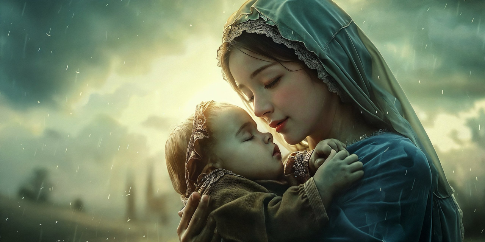

# Korean

프레임 얘기 나온 김에 재미난 생각 거리 하나 던져드릴게.

역시 프레임을 많이 벗어냐아 쫌 잘 보이실 거야. 

윤리가 뭘까요? 잘 생각해 보셔.

간단한 문제야. 뭘까? 

나라면 별 고민 안 하고 걍 '인간이 만든 거다'라고 답할 거야. 

그럼 '신'은? 

응, 여기서도 난 어차피 종교가 없기 때문에 일단 '인간이 만든 거다'라고 할 거야.

삼체 얘기 해보면... 스포일러 싫으면 읽지 마시고.

우주로 나가면 응, 인간의 세상이 아니야. 그래서 윤리가 없어. 신도 없어. 다 인간이 만든 거라. 삼체인을 만났을 때 인간의 대처법이 삑사리가 나는 이유야. 삼체인한테 인간의 프레임을 기대하니까. 윤리가 어쩌고. 신이 어쩌고, 사랑이 어쩌고. 웃기잖아. 인간이 만든 개념인데.

암흑의 숲 논리가 그거라고. 기본 전제가 우주에는 윤리가 없다야. 흑백 논리, 선악구조, 응 이거 다 인간의 프레임이라고.

소울즈본 게임을 만든 미야자키 히데타카 사례를 자꾸 들어드리는 건, 인간의 프레임을 최대한 벗어나는 친구이기 때문이야. 윤리가 됐든, 신이 됐든, 미지의 존재가 됐든, 인간의 프레임을 최대한 벗어나서 바라보거든. 그래서 이 친구 게임이 재미있는 거야. 

그럼, 더 재밌는 사례를 고민해 보셔.

인간한테도 '윤리'가 있다고는 우기는데 사실은 존재하지 않는 영역이 있어. 눈치 채셨어?

응, 대표적인 게... 정치판, 전장, 금융시장이야.

아마, 있다고 우길 거야. 근데 현실적으로 없어. 아니, 윤리를 지키려면 발 디디면 안 되는 곳이야. 

또 삼체 스포일러인데... 2대 검잡이로서 청신의 가장 큰 실수는 너무도 인간적이었다는 거야. 마치 성모 마리아같은. 그게 인간에나 통하는 거라고. 사랑? 사랑이라는 이름으로 인류를 멸망으로 몰고가는 게 청신이야. 삼체인은 그걸 간파해. 1대 검잡이인 면벽자 뤄지는 한순간의 망설임도 없이 삼체인이 쳐들어오면 공멸하는 장치의 버튼을 누를 인간인데, 청신은 그럴 수 없는 성모 마리아 같은 존재거든. 실제로 2대 검잡이가 되자마자 인류를 멸망으로 몰고가는 존재야. 단 몇분만에. 충격적이지. 삼체인이 그걸 단번에 간파한 거라고. 저 공멸 장치의 버튼을 못 누를 사람이란 걸. 

2권에서 우주 함대가 공멸하는 장면에서도 비슷한 인간적 딜레마가 나와. 과거에서 동면했다 깨어나는 장뻬이하이라는 인물은 인류의 약점을 절감하는 캐릭터야. 우주 함대 함선 셋 중 하나만 살아남을 수밖에 없는 상황인데 젊은 함장과 수뇌부가 고민만 하는 거야. 아군끼리 죽여야 하니까. 인간적인 딜레마지. 그걸 지켜보던 장빼이하이가 대신 버튼을 눌러주려고 하는데, 그 냉철한 장빼이하이마저 마지막 순간 몇 초를 망설여서 조금 더 냉철했던 다른 함대에 공격 당해 모두 죽고 말아. 많이 감동적이고 슬프고 안쓰럽고 그런 장면이야. 어차피 함선 하나만 살아남을 상황이기 때문에 인간적 감정을 배제해야 하는 상황이었던 거야. 삼체인이었다면 1초도 안 망설였을 거야. 

다시 금융시장으로 돌아와바. 어차피 윤리가 존재하기 어려운 암흑의 숲이야. 거기다 이젠 감정을 완전히 배제할 수 있는 인공지능까지 동원돼. 인공지능이 학습한 인간의 윤리는, 응 인간의 윤리일 뿐이야. 언제나 제거가 가능해.

그럼, 터미네이터를 떠올려보셔. 터미네티어의 존재 이유는 목표 제거야. 이 목표를 제거할 때까진 멈추지 않아.

"Listen, and understand! That Terminator is out there! It can't be bargained with. It can't be reasoned with. It doesn't feel pity, or remorse, or fear. And it absolutely will not stop... ever, until you are dead!"

'터미네이터 1'에서 미래의 전사 카일 리스가 갑갑해서 외치는 소리야. 인간들이 이해를 못 하니까. 그치? 

응, 이걸 암흑의 숲 금융시장에 적용해봐. 어떤 일이 벌어질지. 삼체의 주요 테마 중 하나인 '암흑의 숲' 이론을 적용해 보라고. 윤리가 존재할 수 없는 암흑의 숲에선 다른 존재 자체가 나한테 위협인 거야. 그런 존재를 알아채면 무조건 선수를 치는 게 상책인 거고.

이 암흑의 숲인 금융시장에 터미네이터처럼 '무슨 수를 써서라도 돈을 번다'는 맹목적인 목적을 주입한 인공지능이 투입되는 시나리오를 써 보라고.

암흑의 숲 우주나 다름 없는 금융시장이라는 공간. 뭐 그런 시나리오.

별거 없어. 현존하는 SOTA(State of the Art) 모형만으로도 충분히 가능해. 윤리 안전망 레이어 걷어내고 파인튜닝만 해도 가능한 일이야. 

그런 인공지능들이 서로 싸우는 암흑의 숲 금융시장. 

프레임은 재미있는 거야. 넘어버릇 하면 걍 시나리오나 소설 쓰기, 만화 그리기야. 근데, 자꾸 해보면 그럴듯해진다고.

많이 과격해야 해. 그래야 벗어날 수 있어. 조심스러우면 프레임에 다시 빨려들어가.

에이, 설마 금융시장이 그 정도는 아닐 거 같아?

역시 순진하셔.

# English

Since we're talking about frames, let me throw you an interesting thought.

You'll see it better if you step out of your frames a bit more.

What is ethics? Think carefully.

It's a simple question. What is it?

If it were me, I'd answer without much hesitation, "It's something humans created."

Then what about 'God'?

Yeah, since I don't have a religion anyway, I'd say "It's something humans created" for this too.

Let's talk about The Three-Body Problem... if you don't like spoilers, don't read on.

When you go out into the universe, yeah, it's not a human world. So there's no ethics. No God either. They're all human creations. That's why humans' response to meeting the Trisolarans goes awry. Because they expect human frames from the Trisolarans. Talking about ethics, God, love. It's ridiculous. These are concepts created by humans.

The Dark Forest theory is about that. The basic premise is that there's no ethics in the universe. Black and white logic, good and evil structure, yeah, these are all human frames.

The reason I keep mentioning Hidetaka Miyazaki, who created the Souls-borne games, is because he's someone who steps out of human frames as much as possible. Whether it's ethics, God, or unknown beings, he looks at them from outside the human frame as much as possible. That's why his games are interesting.

Now, think about an even more interesting case.

There are areas where 'ethics' supposedly exist for humans, but in reality, they don't. Have you noticed?

Yeah, typical examples are... politics, battlefields, financial markets.

You might insist they exist. But realistically, they don't. No, these are places you shouldn't set foot in if you want to keep your ethics.

Another Three-Body spoiler... Cheng Xin's biggest mistake as the second Swordholder was that she was too human. Like the Virgin Mary. That only works among humans. Love? Cheng Xin drives humanity to extinction in the name of love. The Trisolarans see through this. Luo Ji, the first Swordholder, is someone who would push the button for mutual destruction without a moment's hesitation if the Trisolarans invade, but Cheng Xin is like the Virgin Mary who can't do that. In fact, as soon as she becomes the second Swordholder, she becomes the entity that drives humanity to extinction. In just a few minutes. It's shocking. The Trisolarans saw through it immediately. That she's someone who can't push that mutual destruction button.

A similar human dilemma appears in the scene where the space fleet is mutually destroyed in the second book. Zhang Beihai, a character who wakes up from hibernation from the past, is someone who keenly feels humanity's weakness. In a situation where only one out of three space fleet ships can survive, the young captain and leadership are just agonizing. Because they have to kill their own comrades. It's a human dilemma. Zhang Beihai, who's been watching this, tries to push the button instead, but even the cold-hearted Zhang Beihai hesitates for a few seconds at the last moment, and they all end up dying, attacked by another fleet that was a bit colder. It's a very moving, sad, and pitiful scene. It was a situation where human emotions had to be excluded because only one ship could survive anyway. If it were the Trisolarans, they wouldn't have hesitated for even a second.

Let's come back to the financial market. It's a dark forest where ethics can hardly exist. And now artificial intelligence that can completely exclude emotions is being mobilized. The human ethics that AI has learned are, well, just human ethics. They can always be removed.

Now, think about the Terminator. The Terminator's reason for existence is to eliminate the target. It won't stop until this target is eliminated.

"Listen, and understand! That Terminator is out there! It can't be bargained with. It can't be reasoned with. It doesn't feel pity, or remorse, or fear. And it absolutely will not stop... ever, until you are dead!"

This is what Kyle Reese, the warrior from the future, shouts in frustration in 'Terminator 1'. Because humans don't understand. Right?

Yeah, apply this to the dark forest financial market. What would happen? Try applying the 'Dark Forest' theory, which is one of the main themes of The Three-Body Problem. In a dark forest where ethics can't exist, the mere existence of another being is a threat to me. If you notice such a being, it's best to strike first unconditionally.

Write a scenario where AI with the blind purpose of 'making money by any means necessary' like a Terminator is introduced into this dark forest financial market.

A space like the financial market, no different from the dark forest universe. That kind of scenario.

It's nothing special. It's entirely possible with existing SOTA (State of the Art) models. It's possible just by removing the ethical safety net layer and fine-tuning.

A dark forest financial market where such AIs fight each other.

Frames are interesting. Once you get used to crossing them, it's just writing scenarios or novels, drawing comics. But if you keep doing it, it starts to seem plausible.

It has to be very extreme. That's how you can break free. If you're cautious, you'll get sucked back into the frame.

Ah, surely the financial market can't be that bad?

You're still naive.

# Japanese

フレームの話が出たついでに、面白い考え事を一つ投げかけるよ。

やっぱりフレームから多く抜け出すほど、少しはよく見えるはずだ。

倫理って何だろう？よく考えてみろよ。

簡単な問題だ。何だろう？

俺なら特に悩まずに、ただ「人間が作ったものだ」って答えるね。

じゃあ、「神」は？

そう、ここでも俺はどうせ宗教がないから、とりあえず「人間が作ったものだ」って言うよ。

三体の話をしてみると...スポイラーが嫌なら読むなよ。

宇宙に出ると、そう、人間の世界じゃないんだ。だから倫理がない。神もいない。全部人間が作ったものだ。三体人に会ったときに人間の対処法がずれる理由だ。三体人に人間のフレームを期待するから。倫理がどうのこうの。神がどうのこうの、愛がどうのこうの。おかしいだろ。人間が作った概念なのに。

暗黒森林の論理がそれだ。基本前提が宇宙には倫理がないってことだ。白黒論理、善悪構造、そう、これら全部人間のフレームだ。

ソウルズボーンゲームを作った宮崎英高の例をよく挙げるのは、人間のフレームを最大限に脱する奴だからだ。倫理にしろ、神にしろ、未知の存在にしろ、人間のフレームを最大限に脱して見るんだ。だからこいつのゲームが面白いんだ。

じゃあ、もっと面白い事例を考えてみろよ。

人間にも「倫理」があるって主張するけど、実際には存在しない領域があるんだ。気づいたか？

そう、代表的なのが...政治の場、戦場、金融市場だ。

おそらく、あると主張するだろ。でも現実的にはない。いや、倫理を守ろうとすれば足を踏み入れちゃいけない場所なんだ。

また三体のスポイラーだけど...2代目執剣者としての程心の最大の失敗は、あまりにも人間的だったってことだ。まるで聖母マリアのような。それが人間にしか通用しないんだ。愛？愛って名で人類を滅亡に追い込むのが程心だ。三体人はそれを見抜く。初代執剣者の面壁者羅輯は一瞬のためらいもなく三体人が攻めてきたら共滅する装置のボタンを押す人間だけど、程心はそれができない聖母マリアのような存在なんだ。実際に2代目執剣者になるやいなや人類を滅亡に追い込む存在だ。たった数分で。衝撃的だろ。三体人がそれを一目で見抜いたんだ。あの共滅装置のボタンを押せない人だってことを。

2巻で宇宙艦隊が共滅するシーンでも似たような人間的ジレンマが出てくる。過去から冬眠して目覚める章北海って奴は人類の弱点を痛感するキャラクターだ。宇宙艦隊の船3つのうち1つしか生き残れない状況なのに、若い艦長と首脳部が悩んでばかりいるんだ。味方同士で殺し合わなきゃいけないから。人間的なジレンマだ。それを見ていた章北海が代わりにボタンを押そうとするんだけど、その冷徹な章北海さえも最後の瞬間数秒ためらって、もう少し冷徹だった他の艦隊に攻撃されて全員死んじまうんだ。とても感動的で悲しくて哀れな場面だ。どうせ艦船1つしか生き残れない状況だったから、人間的感情を排除しなきゃいけない状況だったんだ。三体人だったら1秒も迷わなかっただろ。

再び金融市場に戻ろう。どうせ倫理が存在しにくい暗黒森林だ。そこに今や感情を完全に排除できる人工知能まで動員されてる。人工知能が学習した人間の倫理は、そう、人間の倫理に過ぎない。いつでも除去が可能だ。

じゃあ、ターミネーターを思い浮かべてみろよ。ターミネーターの存在理由は目標除去だ。この目標を除去するまで止まらない。

Listen, and understand! That Terminator is out there! It can't be bargained with. It can't be reasoned with. It doesn't feel pity, or remorse, or fear. And it absolutely will not stop... ever, until you are dead!

「ターミネーター1」で未来の戦士カイル・リースがもどかしくて叫ぶ声だ。人間たちが理解できないから。そうだろ？

そう、これを暗黒森林の金融市場に適用してみろよ。どんなことが起こるか。三体の主要テーマの一つである「暗黒森林」理論を適用してみろ。倫理が存在できない暗黒森林では、他の存在自体が俺への脅威なんだ。そんな存在に気づいたら無条件で先手を打つのが得策なんだ。

この暗黒森林である金融市場に、ターミネーターのように「どんな手を使っても金を稼ぐ」って盲目的な目的を注入した人工知能が投入されるシナリオを書いてみろよ。

暗黒森林宇宙と変わらない金融市場って空間。そんなシナリオだ。

大したことない。現存するSOTA（State of the Art）モデルだけでも十分に可能だ。倫理安全網レイヤーを取り除いてファインチューニングするだけで可能なことだ。

そんな人工知能たちが互いに戦う暗黒森林の金融市場。

フレームは面白いもんだ。越える癖がつけば、ただシナリオや小説を書いたり、漫画を描いたりするようなもんだ。でも、何度もやってみると、それらしくなってくる。

かなり過激じゃないとダメだ。そうしないと抜け出せない。慎重だとフレームに再び引き込まれちまう。

いや、さすがに金融市場がそこまでじゃないだろ？

やっぱり純粋だな。

# Chinese

既然说到了框架，我给你们抛个有趣的思考题。

如果你能更多地跳出框架，就会看得更清楚一些。

什么是伦理？好好想想。

这是个简单的问题。是什么呢？

如果是我，我会毫不犹豫地回答"是人类创造的东西"。

那么"神"呢？

是的，在这里我反正没有宗教信仰，所以我也会说"是人类创造的东西"。

让我们谈谈《三体》...如果你不喜欢剧透，就不要继续读下去。

当你走向宇宙，是的，那不是人类的世界。所以没有伦理。也没有神。这些都是人类创造的。这就是为什么人类在遇到三体人时的应对方式会出错。因为他们期望三体人有人类的框架。谈论伦理、神、爱。这很可笑。这些都是人类创造的概念。

黑暗森林理论就是关于这个的。基本前提是宇宙中没有伦理。黑白逻辑、善恶结构，是的，这些都是人类的框架。

我之所以一直提到创造魂系列游戏的宫崎英高，是因为他是一个尽可能跳出人类框架的人。无论是伦理、神还是未知存在，他都尽可能地从人类框架之外去看待。这就是为什么他的游戏很有趣。

现在，想想一个更有趣的例子。

对人类来说，有些领域声称存在"伦理"，但实际上并不存在。你注意到了吗？

是的，典型的例子是...政治、战场、金融市场。

你可能会坚持说它们存在。但现实中，它们并不存在。不，如果你想遵守伦理，这些是你不应该踏足的地方。

再来个《三体》剧透...作为第二任执剑人，程心最大的错误是她太人性化了。就像圣母玛利亚一样。那只在人类中有效。爱？程心以爱的名义将人类推向灭亡。三体人看穿了这一点。第一任执剑人面壁者罗辑是一个在三体人入侵时会毫不犹豫按下互相毁灭装置按钮的人，但程心是一个像圣母玛利亚一样无法这样做的存在。事实上，一旦她成为第二任执剑人，她就成为了推动人类灭亡的存在。仅仅几分钟内。这很震撼。三体人立即看穿了这一点。她是一个无法按下那个互相毁灭按钮的人。

在第二部中，太空舰队互相毁灭的场景中也出现了类似的人性困境。从过去hibernation中醒来的张北海这个角色，是深刻感受到人类弱点的人。在三艘太空舰船中只有一艘能生存的情况下，年轻的舰长和领导层只是在纠结。因为他们必须杀死自己的同伴。这是人性的困境。一直在观察这一切的张北海试图代替他们按下按钮，但即使是冷酷的张北海在最后一刻也犹豫了几秒钟，结果他们全都死了，被另一个更冷酷的舰队攻击。这是一个非常感人、悲伤和可怜的场景。因为无论如何只有一艘船能生存，所以这是一个必须排除人性情感的情况。如果是三体人，他们连一秒都不会犹豫。

让我们回到金融市场。这是一个几乎不存在伦理的黑暗森林。现在，能完全排除情感的人工智能也被投入使用。人工智能学习到的人类伦理，嗯，只是人类的伦理。它们随时可以被移除。

现在，想想终结者。终结者存在的理由是消灭目标。在这个目标被消灭之前，它不会停止。

Listen, and understand! That Terminator is out there! It can't be bargained with. It can't be reasoned with. It doesn't feel pity, or remorse, or fear. And it absolutely will not stop... ever, until you are dead!

这是《终结者1》中来自未来的战士Kyle Reese因沮丧而喊出的话。因为人类不理解。对吧？

是的，把这个应用到黑暑森林金融市场。会发生什么。试着应用《三体》的主要主题之一"黑暗森林"理论。在一个不能存在伦理的黑暗森林中，其他存在本身就是对我的威胁。如果你注意到这样的存在，无条件先发制人是最好的策略。

写一个场景，其中像终结者一样注入了"不惜一切代价赚钱"这一盲目目的的人工智能被引入这个黑暗森林金融市场。

一个和黑暗森林宇宙没什么不同的金融市场空间。那样的场景。

没什么特别的。用现有的SOTA（State of the Art）模型就完全可能。只要移除伦理安全网层并进行微调就可能实现。

这样的人工智能相互争斗的黑暗森林金融市场。

框架是有趣的。一旦习惯了跨越它们，就只是在写场景或小说，画漫画。但如果你一直这样做，它开始变得似乎可信。

它必须非常极端。这样你才能挣脱出来。如果你太谨慎，你会被重新吸回框架中。

啊，金融市场应该不会那么糟糕吧？

你还是太天真了。

