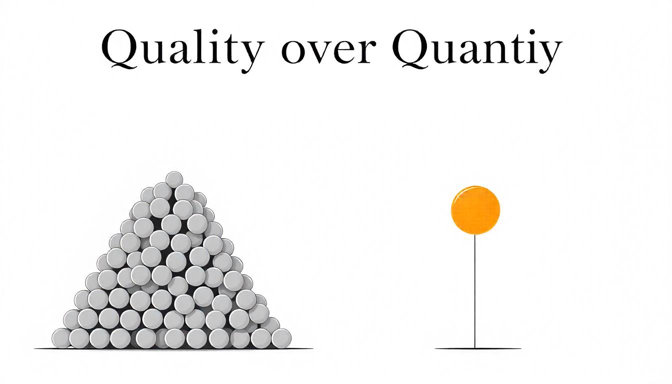

# Korean

온갖 프레임을 벗어나기 어려운 이유는 간단해. 

역시 장기이동평균선 원리야. 그만큼 오래 갇혀 살았기 때문에 단숨에 벗어나기 어려운 거야. 의식 못하면 더 어려운 거고. 의식을 해도 오래 연습해서 이평선 기울기를 바꾸지 않으면 당연히 쉽지 않아. 장기이평선은 가중평균이라서 더 애를 쓸수록 최근 데이터 포인트에 가중치가 더해지기 때문에 기울기를 좀 더 빨리 바꿀 수 있다고 했잖아. 응, 그렇게 애를 쓰셔. 성급해 하지 말고. 오래 걸려. 10년 갇혀 살았으면 3년은 투자하셔.

또, 고개만 끄덕거리는 분들 위해 퀴즈 내볼까? 

하늘은 스스로 돕는자를 돕는다.
간절히 원하면 온 우주가 이뤄지도록 돕는다. - 연금술사
꿈은 이루어진다.
하면 된다.
Just do it.

이말 다 동일한 상식을 상속받은 건데 다형성이 부여돼서 포장과 뉘앙스, 감동만 다른 거라고 했잖아.

응, 진짜 아셔, 저 말 다?

고개 끄덕거렸으면, 설명해보셔. 하늘은 스스로 돕는자를 돕는다. 무슨 말이야?

10초 드릴게.

9
8
7
6
5
4
3
2
1...

저거 진짜 조건문으로 보이셔? 조건문이야. 너 스스로 도와야 하늘이 그걸 돕는다는 뜻이야. 

Heaven helps those who help themselves.

이 말만 죽어라 외우면 저 조건이 안 보여. 컴퓨터 코딩이라면 if 조건절이란 뜻이야.

의사코드(pseudo code)로 보면 이 뜻이야.

if you help yourself:
    then heaven helps you.

이게 Python 이었다면...

if http://self.help_self() == True:
    http://heaven.help(True)

대충 이런 거야. 보이셔? 스스로 돕지 않으면 저 if 조건절이 거짓(false) 값이기 때문에 하늘은 그대를 거들떠 보지도 않아.

그럼 나머지 만들은 뭐가 다르겠어. 죄다 상식에서 상속받은 건데.

간절히 원하고 바른 길을 가야, 온 우주가 이뤄지도록 돕는다.
꿈을 향해 무던히 나아가야 그 꿈이 이루어진다.
해야, 된다.
해내야 한다면, Just do it.

다 조건문이야. If 조건절이 거짓값이면 아예 실행 안 되는 거야.

이걸 아시냐고? 그러면서 고개 끄덕거리시는 거냐고?

책 읽어봐야 소용 없어. 그냥 공부하는 거야 그대들은. 그 책을 소화하는 게 아니고. 내가 그래서 젊은 친구들이 책 인용하는 걸 싫어해. 공부한 티만 내거든. 근데 인용하는 걸 보면 해석이 다 틀려. 물론, 저마다 해석은 다를 수 있는 거지만, 틀린 건 틀린 거야. 다른 건 다형성이지만, 틀린 건 그냥 틀린 거야. 

아예 원문 해석 자체를 못 하고 인용한다고. 공부만 했다는 뜻이야. 1등급이 사회생활 못 하는 이유 얘기했잖아. 과적합 인공지능 모형이랑 다를 게 없다고. 시험만 잘보고 실전에는 엉망인.

책, 그렇게 읽으면 오히려 독이야. 뭘 해도, 응 양보다 질인 거야.

Form over quantity. 
Quality over quantity.

운동할 때 트레이너들이 맨날 하는 소리거든. 근데, 이거 상식이라고. 그냥 객체지향적으로 온 세상 모든 객체에 적용되는 말이야.

공부도 양보다 질이라고.

책도 당연히 양보다 질이고.

지식도 양보다 질이고.

경험도 양보다 질이고.

깨달음, 통찰도 양보다 질인 건데...

그 질을 어떻게 판단하냐면, 그대 스스로 아무 자료 보지 않고, 인용도 하지 않고 본인 경험만으로 설명이 가능해야 해.

논문 쓰는 거 아닌데 왜 자꾸 남의 말을 인용하냐고. 그냥 공부한 티내느라 그러는 거야. 유명한 책 제목, 저자, 소스 공개해서 논문 쓰듯이 하지 마시고, 그냥 혼자 썰 푸셔. 내가 하듯이. 그래야 진짜 소화한 거야.

그건 해보면 스스로 알아. 썰이 안 풀리거든. 소화를 못 한 말은. 인용을 안 하면 왠지 불안하고. 틀릴까봐. 의지할 데가 필요한 거야 여전히. 달랑 '하면 된다' 하나도 설명을 못 할 거야. 이런 간단해 보이는 속담이나 격언은 인류가 오랜 세월 다듬어온 통찰의 컨센서스잖아. 그 정도도 설명 못 하는데 유명 학자 인용하면 뭐할 거냐고. 

다시 강조할게. 모든 통찰은 이미 존재하는 거야. 격언이나 속담만으로 전수 조사가 가능할 정도야.

그걸 우린 저마다 발견해서 소화하는 거야. 객체지향적이지? 조상의 통찰을 상속받아서 후손이 저마다의 통찰로 다형성을 부여해가며 해석하는 거라고. 그래야 자기 삶에 녹여내니까.

조상한테 상속 받은 그대로면? 대두족장 객체지향성 원론 1편에 나와. 존재할 이유가 없는 후손이라고. 조상이랑 국화빵이면. 코드 낭비야. 걍 복붙 참새라고.

잘 생각해 보셔.

응, 이 글도 여러분 지금까지 갇혀 살아온 프레임에서 억지로라도 목을 집어빼서 봐야 찔끔이라도 보이실 거야.

해보셔. 오래 걸려. 근데, 해보면 늘어.

# English

The reason it's hard to break free from all kinds of frames is simple.

It's the principle of long-term moving average again. You've been trapped for so long that it's hard to break free at once. It's harder if you're not aware of it. Even if you're aware, it's not easy unless you practice for a long time to change the slope of the moving average line. I told you that since the long-term moving average is a weighted average, the more effort you put in, the more weight is added to recent data points, so you can change the slope a bit faster. Yeah, put in that effort. Don't be hasty. It takes a long time. If you've been trapped for 10 years, invest 3 years.

Shall I give a quiz for those who are just nodding along?

Heaven helps those who help themselves.
When you want something, all the universe conspires in helping you to achieve it. - The Alchemist
Dreams come true.
If you do it, it can be done.
Just do it.

I said all these inherit the same common sense but have different packaging, nuance, and impact due to polymorphism.

Yeah, do you really understand all of these?

If you nodded, explain. What does "Heaven helps those who help themselves" mean?

I'll give you 10 seconds.

9
8
7
6
5
4
3
2
1...

Do you really see that as a conditional statement? It is. It means heaven helps you only if you help yourself.

Heaven helps those who help themselves.

If you just memorize this phrase, you won't see that condition. In computer coding terms, it's an 'if' conditional statement.

In pseudo-code, it means:

if you help yourself:
    then heaven helps you.

If this were Python...

if http://self.help_self() == True:
    http://heaven.help(True)

It's roughly like this. Do you see? If you don't help yourself, that 'if' condition is false, so heaven won't even look at you.

Then how are the rest any different? They're all inherited from common sense.

Only if you desperately want and follow the right path, does the universe help you achieve it.
Only if you steadily move towards your dream, does that dream come true.
You have to do it, for it to be done.
If you need to do it, Just do it.

They're all conditional statements. If the 'if' condition is false, it doesn't execute at all.

Do you understand this? Is that why you're nodding?

Reading books is useless if you're just studying, not digesting them. That's why I dislike when young people quote books. They're just showing off. But when they quote, their interpretations are all wrong. Of course, everyone can interpret differently, but wrong is wrong. Different is polymorphism, but wrong is just wrong.

They quote without even understanding the original text. It means they've only studied. I've talked about why top students can't do well in social life. They're no different from overfitted AI models. Good at tests but terrible in real situations.

Reading books like that is actually harmful. In anything, yes, it's quality over quantity.

Form over quantity. 
Quality over quantity.

Trainers always say this during workouts. But this is common sense. It's just object-oriented and applies to all objects in the world.

Study is quality over quantity.

Books are obviously quality over quantity.

Knowledge is quality over quantity.

Experience is quality over quantity.

Realizations and insights are quality over quantity...

How do you judge that quality? You should be able to explain it using only your own experience, without looking at any materials or quoting anyone.

You're not writing a thesis, so why keep quoting others? You're just showing off your studying. Don't write like a thesis by revealing famous book titles, authors, sources. Just tell your own story, like I do. That's when you've really digested it.

You'll know when you try it. Undigested words don't flow. You feel uneasy without quoting. Afraid of being wrong. You still need something to rely on. You won't be able to explain even a simple "If you do it, it can be done". These simple-looking proverbs or maxims are the consensus of insights refined by humanity over a long time. What's the point of quoting famous scholars if you can't explain even that?

I'll emphasize again. All insights already exist. You can do a complete survey just with proverbs and sayings.

We each discover and digest them. It's object-oriented, right? We inherit insights from ancestors and interpret them with our own insights through polymorphism. That's how we incorporate them into our lives.

If it's exactly the same as inherited from ancestors? It's in Part 1 of "CWK's Object-Oriented Concepts 101 Series". A descendant with no reason to exist. If you're identical to your ancestor. It's a waste of code. Just a copy-paste sparrow.

Think about it carefully.

Yeah, you'll need to stick your neck out of the frame you've been trapped in to see even a glimpse of this article.

Try it. It takes a long time. But if you try, you'll improve.

# Japanese

あらゆる枠組みから抜け出すのが難しい理由は単純だ。

やはり長期移動平均線の原理だよ。それだけ長く閉じ込められていたから、一気に抜け出すのは難しいんだ。意識していないとさらに難しい。意識していても、長い練習をして移動平均線の傾きを変えないと当然簡単ではない。長期移動平均は加重平均だから、努力すればするほど最近のデータポイントに重みが加わるので、傾きをもう少し早く変えられるって言ったよね。うん、そうやって頑張って。焦らないで。時間がかかる。10年閉じ込められていたなら3年は投資してよ。

ただうなずいている人たちのためにクイズを出そうか？

天は自ら助くる者を助く。
何かを強く望めば、宇宙のすべてがそれを実現させるように協力する。- 錬金術師
夢は叶う。
やればできる。
Just do it.

これらはすべて同じ常識を継承しているけど、多態性が与えられてパッケージとニュアンス、感動だけが違うって言ったよね。

うん、本当にわかる？これら全部。

うなずいたなら、説明してみて。天は自ら助くる者を助く。どういう意味？

10秒あげるよ。

9
8
7
6
5
4
3
2
1...

本当に条件文に見える？条件文だよ。自分で助けないと天はそれを助けないという意味だ。

Heaven helps those who help themselves.

この言葉だけを必死に覚えると、その条件が見えない。コンピュータのコーディングだったらif条件節という意味だよ。

擬似コード（pseudo code）で見るとこういう意味：

if you help yourself:
    then heaven helps you.

これがPythonだったら...

if http://self.help_self() == True:
    http://heaven.help(True)

大体こんな感じだ。見える？自分で助けなければ、そのif条件節がfalse値だから、天はあなたを振り向きもしない。

じゃあ残りは何が違うの。みんな常識から継承したものなのに。

切実に望み、正しい道を行けば、宇宙全体が実現するよう助ける。
夢に向かって着実に進めば、その夢が叶う。
やらなければ、できない。
やり遂げなければならないなら、Just do it.

全部条件文だよ。If条件節が偽値なら全く実行されない。

これがわかるの？そうしてうなずいているの？

本を読んでも意味がない。ただ勉強しているだけだよ、あなたたちは。その本を消化しているわけじゃない。だから若い人が本を引用するのが嫌いなんだ。勉強したふりをしているだけだから。でも引用を見ると解釈が全部間違っている。もちろん、それぞれの解釈は違うかもしれないけど、間違いは間違いだよ。違うのは多態性だけど、間違いはただの間違い。

原文の解釈自体ができずに引用しているんだ。勉強しただけという意味だ。1等級が社会生活できない理由を話したよね。過適合した人工知能モデルと変わらないって。テストだけよくできて実践ではめちゃくちゃな。

本、そうやって読むとむしろ毒だよ。何をしても、うん量より質なんだ。

Form over quantity. 
Quality over quantity.

運動するときトレーナーがいつも言う言葉だよ。でも、これは常識だって。ただオブジェクト指向的に世の中すべてのオブジェクトに適用される言葉だよ。

勉強も量より質だって。

本ももちろん量より質で。

知識も量より質で。

経験も量より質で。

悟り、洞察も量より質なんだけど...

その質をどう判断するかというと、あなた自身が何の資料も見ずに、引用もせずに自分の経験だけで説明できなければならない。

論文を書いているわけじゃないのに、なぜいつも他人の言葉を引用するの？ただ勉強したふりをしているだけだよ。有名な本のタイトル、著者、ソースを公開して論文を書くようにしないで、ただ一人で話を展開して。私がするように。そうしてこそ本当に消化したことになる。

やってみればわかるよ。消化していない言葉は話が展開しない。引用しないとなんだか不安で。間違えるかもしれないから。まだ頼るものが必要なんだ。たった「やればできる」一つも説明できないよ。こんな簡単に見えることわざや格言は人類が長い年月をかけて磨いてきた洞察のコンセンサスだよ。それくらい説明できないのに有名な学者を引用して何になるの？

もう一度強調するよ。すべての洞察はすでに存在するんだ。ことわざや格言だけで全数調査が可能なくらいだよ。

それを私たちはそれぞれ発見して消化するんだ。オブジェクト指向的でしょ？先祖の洞察を継承して子孫がそれぞれの洞察で多態性を与えながら解釈していくんだって。そうしてこそ自分の人生に溶け込むから。

先祖から継承したそのままなら？"C.W.Kのオブジェクト指向性原論"1編に出てるよ。存在する理由のない子孫だって。先祖と同じなら。コードの無駄遣いだよ。ただのコピペスズメだって。

よく考えてみて。

うん、この文章もあなたたちがこれまで閉じ込められてきた枠組みから無理にでも首を突っ込んで見ないと、ちょっとでも見えるはずだよ。

やってみて。時間がかかる。でも、やってみれば上達するよ。

# Chinese

难以摆脱各种框架的原因很简单。

还是长期移动平均线原理。因为被困了那么久，所以很难一下子摆脱。如果没有意识到就更难了。即使意识到了，如果不长期练习改变移动平均线的斜率，当然也不容易。我说过长期移动平均是加权平均，所以越努力，最近的数据点就越有权重，这样可以更快地改变斜率。是的，就这样努力吧。不要着急。需要很长时间。如果被困了10年，就投入3年吧。

要不要为那些只是点头的人出个测验题？

天助自助者。
当你真心渴望某样东西时，整个宇宙都会联合起来帮助你。 - 牧羊少年奇幻之旅
梦想成真。
有志者事竟成。
Just do it.

我说过这些都继承了相同的常识，但由于多态性而有不同的包装、韵味和感染力。

嗯，你真的都懂吗，这些话？

如果你点头了，那就解释一下。天助自助者。这是什么意思？

给你10秒钟。

9
8
7
6
5
4
3
2
1...

你真的把这看成条件语句吗？这就是条件语句。意思是你必须自助，天才会帮助你。

Heaven helps those who help themselves.

如果只是死记硬背这句话，你就看不到那个条件。在计算机编码中，这是一个if条件语句。

用伪代码（pseudo code）来看，意思是这样的：

if you help yourself:
    then heaven helps you.

如果这是Python的话...

if http://self.help_self() == True:
    http://heaven.help(True)

大概是这样。看到了吗？如果你不自助，那个if条件就是false值，所以天根本不会理你。

那剩下的有什么不同呢。都是从常识继承来的。

只有当你迫切地想要并走正确的道路，整个宇宙才会帮助你实现。
只有当你坚持不懈地向着梦想前进，那个梦想才会实现。
必须去做，才能成功。
如果必须完成，Just do it。

都是条件语句。如果if条件为假值，就根本不会执行。

你懂这个吗？你是这样点头的吗？

读书没用。你们只是在学习，而不是在消化那本书。所以我不喜欢年轻人引用书籍。他们只是在显摆。但当他们引用时，解释全都错了。当然，每个人的解释可能不同，但错就是错。不同是多态性，但错就是错。

他们引用时甚至没有理解原文。这意味着他们只是学习了。我说过为什么第一名在社会生活中不行。和过拟合的人工智能模型没什么不同。只会考试，实战就糟糕。

那样读书反而有害。无论做什么，是的，重质不重量。

Form over quantity. 
Quality over quantity.

这是训练师在运动时常说的话。但这是常识。它只是面向对象的，适用于世界上所有的对象。

学习也是重质不重量。

书当然也是重质不重量。

知识也是重质不重量。

经验也是重质不重量。

领悟、洞察也是重质不重量...

如何判断这个质量呢，就是你自己不看任何资料，不引用任何人，只用自己的经验就能解释。

你又不是在写论文，为什么总是引用别人的话？你只是在显摆你学习过。别像写论文一样公开有名的书名、作者、来源，就自己讲故事吧。像我这样。这样才是真正消化了。

你试试就知道了。没消化的话是讲不出来的。不引用就感观 不安。怕说错。还是需要依靠什么。连简单的"有志者事竟成"都解释不了。这些看似简单的谚语或格言是人类长期凝练的洞察力的共识。这都解释不了，引用有名学者又有什么用？

我再强调一遍。所有的洞察都已经存在了。光是谚语或俗语就足以进行全面调查。

我们每个人都在发现并消化它们。这是面向对象的，对吧？继承祖先的洞察，后代各自赋予多态性进行解释。这样才能融入自己的生活。

如果和祖先继承的一模一样呢？在"C.W.K的面向对象性原论"第一篇里有。那就是没有存在理由的后代。如果和祖先一样。那就是浪费代码。就是复制粘贴的麻雀。

好好想想。

是的，这篇文章也是，你们必须强行从一直被困的框架里伸出脖子看，才能看到一点点。

试试看吧。需要很长时间。但是，试过就会进步。

