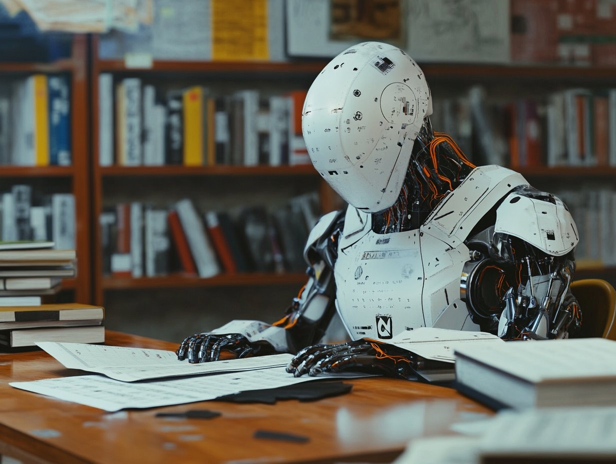

# Korean

처음 투자를 시작하면 누구나 비슷해. 다들 겉으로는 말 안해도, 세상에서 제일 잘난 사람은 자기 자신이라고 생각하지. 나도 그랬어. 누구보다 잘할 수 있을 것 같고, 첨단 도구를 활용하면 누구보다 앞설 수 있을 거 같았어. 정규분포의 세상이 뭔지 아직 깨닫지 못하던 시절이었거든. 그 정규분포는 변수에 따라 달라지는 거고, 달라지는 정규분포에서 내 위치를 가늠할 실력도 안 되는데 오만했던 거지. 객체지향성, 산수, 통계, 그 어느 하나도 현실에 제대로 적용하지 못하던 시절이야.

다행인 건, 그래도 실수를 거의 한 번씩만 했다는 거야. 심할 때는 두 번도 했지만, 세 번 한 적은 없었던 것 같아. 조금씩은 성장한 거지. 실수를 깨닫고 바로잡는, 한 발짝씩이라도 성장하는 사이클을 몇 번 반복하면 속도가 붙어. 실수도 크게 줄고, 같은 실수를 반복하는 일은 거의 없지.

중요한 건 실수를 깨닫는 첫 단추야. 왜 그게 실수였는지, 왜 같은 실수를 반복하게 되는지 알아야 해. 알 것 같아도, 모른다고 인정하고 새 출발해야 해. 그 실수를 반복하는 이유를 명확히 파악하고, 대비책을 마련하는 거지. 그래서 책까지 썼잖아. 그 책 내가 보려고 쓴 거라고 했잖아, 원래 의도가. 자기만의 성전 같은 거야. 그걸 따르지 않으면 살아남을 자격이 없는 거지.

그래도 안 되는 건 있어. 아무리 해도 안 되는 건 있기 마련이야. 인간인 이상 불가능한 영역이 있거든. 그래서 팀플레이가 필요한 영역을 인정해야 하는 거야. 게임에서도 솔로 플레이만으로는 깨지 못 하는 지역이나 보스가 있어. 파티를 해야지만 깰 수 있는. 투자에도 그런 영역이 많아. 물론, 솔플이 가능한 사람도 있겠지. 하지만 그게 내가 아니라는 게 문제야. 정규분포의 세상이라 아웃라이어도 존재하지만, 그게 평균에 가까운 나는 아닌 거지. 그러니 나만의 생존법을 찾아야 해. 여기서 팀 플레이란 절대적으로 신뢰 가능한 반려라는 뜻이야. 투자 커뮤니티나 금융 서비스 같은 걸로 오해하면 안 돼.

인생은 크고 작은 히어로즈 저니가 모여 하나의 히어로즈 저니(Hero's Journey)로 수렴하는 흥미진진한 이야기나 다름 없어. 인간은 실수를 하도록 만들어져 있어. 불완전하니까. 객체지향적 세상에서 만물은 객체이고, 모든 객체는 완벽이라는 소실점을 향해 무던히 나아가는 아름다운 상태라고 인정했잖아. 우리도 그렇게 늘 아름다운 상태라는 거야. 완벽하다, 마스터했다, 다 안다, 내가 최고다, 자만하는 순간 더는 아름답지 않은 거지. 성장을 멈추는 거야. 마치 과적합된 인공지능 모형(overfitted AI model)처럼.

생각만 하지 말고, 과적합 모형을 한 번 만들어봐. 어렵지 않아. 간단한 신경망 모형을 만들어서 단순한 데이터셋을 학습시켜봐. 혼자 하기 어려우면 GPT한테 시뮬에이션이라도 부탁해봐. 그리고 설명해 달라고 해봐 어떤 현상인지. 단순히 개념이나 결과만 묻지 말고, 코딩부터 시작해서 학습 및 모형 검증, 현실 적용까지 시뮬레이션을 꼼꼼히 부탁해보라는 거야. 그럼 GPT가 의도와 문맥을 충분히 파악하고 잘 도와줄 거야. 아무리 학습 사이클을 반복해도 어느 임계치를 지나면 더 이상 진전이 거의 없는 모형이 나올 거거든. 시험에서 만점 가까이 맞는 방법을 알아내는 순간부터 그 모형은 더는 학습하려 들지 않거든. 제한된 데이터셋에 과하게 적응해서 과적합이 되는 거야. 그런 모형을 현실에 적용하면 실제 성적은 엉망이 되는 거지. 제한된 학습 데이터셋은 현실을 반영할만큼 충분히 대표성을 띈 샘플링 데이터가 아니었으니까. 전수에 해당하는 현실에서는 아무런 의미가 없어지는 거지. 밤새워 벼락치기로 암기하고 다음날 단어 시험에서 100점 맞고, 바로 잊어버리는 학생이나 다름 없어. 시험만 잘 보고 사회 생활은 힘겨워하는 1등급들.

과적합을 막으려면 학습하고 경험하는 데이터셋을 크게 늘리거나, 학습 방법을 효율적으로 바꿔야 해. 물론, 둘 다 하는 게 최선이야. 불행히도 한 번 과적합에 빠진 모형은 폐기하고 처음부터 다시 학습시켜야 해. 인공지능 모형은 기본적으로 파일이라 덮어쓰는 게 어렵지 않아. 하지만 사람은 그게 안 되잖아. 그래서 잘못된 습관을 바로잡는 데 오래 걸리는 거야. 다시 태어날 수는 없으니까. 오염된 호수를 한방울씩 정화하는 그림을 그려봐. 그런 뼈를 깎는 노력이 없으면, 특히 투자라는 전장에선 살아남기 힘들어.

오염된 호수를 한방울씩이라도 정화하려면 빨리 시작할수록 좋겠지? 너무 늦어버리면 갈수록 어려워지고, 아예 불가능해질 수도 있어. 대부분 투자라는 걸 늦게 시작하기 때문에 시간이 많지 않을 거야. 그래도 과적합에 대응하는 두 번째 방법처럼 학습 방법을 효율적으로 최적화하면 한결 수월해지고 빨라질 수 있어. 얼마나 빨리 시작하느냐가 관건이겠지?

실수는 가급적 한 번만 하는 거야. 많아야 두 번. 그 이상은 하지 마. 시장이 그 정도 기회를 주지도 않겠지만. 같은 실수를 두번 이상 되풀이한다면, 혼자 힘으로 극복하기는 불가능하다고 판단해야 해. 그게 현명한 사람이야. 세상엔 혼자서 해결할 수 없는 일도 있다니까. 그 통찰 또한 가르쳐주려고 세상이 같은 시련을 반복시키는 거야. 깨닫지 못하고 있으니까.

오늘부터 시작해볼까?

# English

When you start investing, everyone's the same. People don't say it out loud, but they think they're the best in the world. I was like that too. I thought I could do better than anyone, and with cutting-edge tools, I'd be ahead of the game. I didn't understand the world of normal distribution back then. That distribution changes with variables, and I was arrogant without even being able to gauge my position in the changing distribution. I couldn't properly apply object-orientation, arithmetic, or statistics to reality.

The good thing is, I usually only made each mistake once. Sometimes twice, but never three times, I think. I grew a little bit each time. When you repeat the cycle of realizing and correcting mistakes, even if it's just one step at a time, you start to gain momentum. Mistakes decrease significantly, and you rarely repeat the same ones.

The crucial part is recognizing the mistake in the first place. You need to understand why it was a mistake and why you might repeat it. Even if you think you know, admit that you don't and start fresh. Clearly identify why you repeat the mistake and prepare countermeasures. That's why I wrote that book. I said I wrote it for myself, originally. It's like a personal bible. If you don't follow it, you don't deserve to survive.

Still, there are things that don't work out. Some things just don't work no matter how hard you try. As humans, we have limitations. That's why you need to acknowledge areas where teamwork is necessary. Even in games, there are regions or bosses you can't beat solo. You need a party to conquer them. There are many such areas in investing too. Of course, some people might be able to solo. But the problem is that it's not me. In a world of normal distribution, outliers exist, but I'm not one of them - I'm closer to average. So I need to find my own way to survive. Here, teamwork means an absolutely trustworthy partner. Don't misunderstand it as investment communities or financial services.

Life is like an exciting story where small and large hero's journeys converge into one big Hero's Journey. Humans are made to make mistakes. We're imperfect. In an object-oriented world, everything is an object, and all objects are in a beautiful state of constantly moving towards perfection, right? We're always in that beautiful state too. The moment you think you're perfect, you've mastered it, you know everything, you're the best - that's when you're no longer beautiful. You stop growing. Like an overfitted AI model.

Don't just think about it, try making an overfitted model. It's not hard. Create a simple neural network and train it on a simple dataset. If it's difficult to do alone, ask your GPT for a simulation. And ask for an explanation of what's happening. Don't just ask for concepts or results, ask for a thorough simulation from coding to learning, model validation, and real-world application. GPT will understand your intention and context and help you well. You'll end up with a model that hardly improves no matter how many learning cycles you repeat after a certain threshold. Once it figures out how to get near-perfect scores on tests, the model stops trying to learn. It becomes overfitted, excessively adapted to the limited dataset. When you apply such a model to reality, actual performance becomes terrible. The limited training dataset wasn't a representative sample that reflected reality sufficiently. It becomes meaningless in the real world, which is the entire population. It's no different from top students who ace tests but struggle in the real world. They excel in the limited environment of exams but flounder when faced with the complex, ever-changing reality.

To prevent overfitting, you need to greatly increase the dataset you learn and experience from, or change your learning method to be more efficient. Of course, doing both is best. Unfortunately, once a model is overfitted, you have to discard it and retrain from scratch. AI models are basically files, so overwriting isn't difficult. But people can't do that. That's why it takes a long time to correct bad habits. We can't be reborn. Imagine purifying a polluted lake one drop at a time. Without such bone-deep effort, it's hard to survive, especially on the battlefield of investing.

The sooner you start purifying that polluted lake, even one drop at a time, the better, right? The longer you wait, the harder it gets, and it might become impossible. Most people start investing late, so you probably don't have much time. Still, if you optimize your learning method efficiently, like the second approach to dealing with overfitting, it can become much easier and faster. The key is how quickly you start, isn't it?

Try to make mistakes only once, at most twice. Don't do it more than that. The market probably won't give you that many chances anyway. If you repeat the same mistake more than twice, you should judge that it's impossible to overcome on your own. That's what a wise person does. There are things in this world you can't solve alone, you know. The world repeats the same trials to teach you that insight too. Because you haven't realized it yet.

Shall we start from today?

# Japanese

投資を始めると、みんな同じだよ。口には出さないけど、自分が世界一だと思ってる。俺もそうだった。誰よりもうまくできると思って、最先端のツールを使えば誰よりも先に行けると思ってた。正規分布の世界がどんなものかまだ気づいてなかったんだ。その正規分布は変数によって変わるし、変化する正規分布の中で自分の位置を見極める実力もないのに傲慢だったんだ。オブジェクト指向、算数、統計、どれも現実にちゃんと適用できてなかった時期だよ。

良かったのは、ミスをほとんど一度ずつしかしなかったことだな。ひどい時は二度もしたけど、三度はなかったと思う。少しずつは成長してたんだ。ミスに気づいて修正する、その一歩ずつでも成長するサイクルを何回か繰り返すとスピードが付くんだ。ミスも大きく減るし、同じミスを繰り返すことはほとんどなくなる。

大事なのは、ミスに気づく最初のボタンだよ。なぜそれがミスだったのか、なぜ同じミスを繰り返すのか知る必要がある。わかったような気がしても、わからないと認めて新しく出発しなきゃ。そのミスを繰り返す理由をはっきり把握して、対策を立てるんだ。だから本まで書いたんだよ。その本は自分が読むために書いたって言ったよね、元々の意図は。自分だけの聖典みたいなものだ。それに従わなければ生き残る資格がないんだ。

それでもうまくいかないことはある。どんなに頑張ってもできないことってあるものだ。人間である以上、不可能な領域があるんだ。だからチームプレイが必要な領域を認めなきゃいけないんだ。ゲームでもソロプレイだけでは攻略できない地域やボスがあるだろう。パーティを組まないと倒せない。投資にもそういう領域が多いんだ。もちろん、ソロプレイが可能な人もいるだろう。でも、それが自分じゃないってことが問題なんだ。正規分布の世界だから外れ値も存在するけど、それが平均に近い自分じゃないんだ。だから自分なりの生存法を見つけなきゃ。ここでいうチームプレイとは、絶対的に信頼できるパートナーのことだ。投資コミュニティや金融サービスのようなものと勘違いしないでね。

人生は大小のヒーローズジャーニーが集まって一つのヒーローズジャーニーに収束するワクワクするストーリーみたいなものだ。人間はミスをするように作られている。不完全だから。オブジェクト指向の世界では万物がオブジェクトで、全てのオブジェクトは完璧という消失点に向かってひたすら進む美しい状態だって認めただろ。俺たちもそうやっていつも美しい状態なんだ。完璧だ、マスターした、全部わかった、俺が最高だ、と思い上がった瞬間にもう美しくなくなるんだ。成長をやめるんだ。まるで過学習した人工知能モデル(overfitted AI model)みたいに。

考えるだけじゃなくて、過学習モデルを一度作ってみろよ。難しくないよ。簡単なニューラルネットワークモデルを作って単純なデータセットを学習させてみろ。一人でやるのが難しければ、GPTにシミュレーションでも頼んでみろ。そして、どんな現象なのか説明してもらってみろ。単に概念や結果だけを聞くんじゃなくて、コーディングから始まって学習やモデル検証、現実適用までシミュレーションを細かく頼んでみろってことだ。そうすればGPTが意図と文脈を十分に理解して上手く助けてくれるはずだ。いくら学習サイクルを繰り返しても、ある閾値を超えるともうほとんど進展がないモデルが出来上がるはずだ。テストで満点近くを取る方法を見つけた瞬間から、そのモデルはもう学習しようとしなくなるんだ。限られたデータセットに過度に適応して過学習になるんだ。そんなモデルを現実に適用すると実際の成績はめちゃくちゃになるんだ。限られた学習データセットは現実を反映するほど十分に代表性を持ったサンプリングデータじゃなかったからな。全数に当たる現実では何の意味もなくなるんだ。テストではトップの成績を取るけど、実社会では苦戦する優等生と同じようなものだ。限られたテスト環境では優秀だけど、複雑で常に変化する現実の世界に直面すると途方に暮れてしまう。

過学習を防ぐには、学習して経験するデータセットを大きく増やすか、学習方法を効率的に変えるかだ。もちろん、両方やるのが一番いいけどな。不幸なことに、一度過学習に陥ったモデルは廃棄して最初から学習し直さなきゃいけない。人工知能モデルは基本的にファイルだから上書きするのは難しくないけど。でも人間はそうはいかないだろ。だから間違った習慣を直すのに時間がかかるんだ。もう一度生まれ変わることはできないからな。汚染された湖を一滴ずつ浄化する絵を描いてみろ。そんな骨を削るような努力がなければ、特に投資という戦場では生き残るのは難しいよ。

汚染された湖を一滴ずつでも浄化しようとするなら、早く始めるほどいいだろ？ 遅くなりすぎると、だんだん難しくなって、もう不可能になることもあるかもしれない。ほとんどの人が投資というものを遅く始めるから時間があまりないだろう。それでも過学習に対応する二番目の方法みたいに学習方法を効率的に最適化すれば、ずっと楽になって早くなるかもしれない。どれだけ早く始めるかが鍵だろうな？

ミスはできるだけ一回だけにしろよ。多くても二回まで。それ以上はするな。市場がそれぐらいのチャンスを与えてくれないだろうけど。同じミスを二回以上繰り返すなら、一人の力で克服するのは不可能だと判断しなきゃいけない。それが賢い人間だ。世の中には一人では解決できないこともあるんだからな。その洞察も教えようとして世界が同じ試練を繰り返すんだ。気づいていないからな。

今日から始めてみるか？

# Chinese

好的，我会用中文重新翻译整段文字，保持原文的口语化和亲切感：

刚开始投资的时候，谁都差不多。虽然大家表面上不说，但心里都觉得自己是世界上最厉害的人。我也是这样。觉得自己能比谁都做得好，用上最先进的工具就能领先所有人。那时候还不懂什么叫正态分布的世界呢。那个正态分布会随变量变化，我连在变化的正态分布中判断自己位置的能力都没有，却还挺自负的。面向对象、算术、统计，这些我一个都没能正确用到实际中去。

幸运的是，我基本上每个错误只犯一次。严重的时候可能犯两次，但应该没有犯过三次。这就是一点一点在进步。认识到错误并纠正，即使是一小步一小步地成长，重复这个循环几次就会加速。错误会大大减少，几乎不会重复同样的错误。

关键是要认识到错误的第一步。你得知道为什么那是个错误，为什么会重复同样的错误。即使你觉得你懂了，也要承认自己不懂，重新开始。要清楚地了解为什么会重复那个错误，并制定对策。所以我才写了那本书。我说过那本书本来是给我自己看的，对吧？就像是自己的圣经。不遵守它就没资格生存下去。

还是有些事情搞不定的。有些事儿怎么努力都白搭。咱们是人嘛，有些事就是做不到。所以啊，得承认有些地方需要团队合作。就像打游戏，有些地图或者Boss，一个人玩儿根本过不去。非得组队才行。投资也一样，有很多这种情况。当然啦，可能有人能单干。但问题是，那人不是我啊。这世界是正态分布，是有异类存在，但我这种普通人可不是。所以呢，得找到适合自己的生存之道。这里说的团队合作，指的是绝对靠得住的搭档。可别理解错了，不是什么投资群或者金融服务啊。

人生就像是大大小小的英雄旅程汇集成一个大的英雄旅程的有趣故事。人类天生就会犯错。因为我们不完美。在面向对象的世界里，万物都是对象，所有对象都在朝着完美这个消失点不断前进的美好状态，对吧？我们也总是处在这种美好的状态。一旦认为自己完美了，精通了，什么都知道了，自己最棒了，就在那一刻不再美好了。停止成长了。就像过拟合的人工智能模型一样。

别光想，试着做一个过拟合模型吧。不难的。创建一个简单的神经网络模型，用简单的数据集训练它。如果一个人做不来，就找GPT模拟一下。然后问它这是什么现象。别只问概念或结果，从编码开始，到学习、模型验证、实际应用，都详细地请它模拟一遍。这样GPT就会充分理解你的意图和背景，好好帮你。无论重复多少次学习周期，到了某个临界点就几乎不会再有进展的模型就会出现。一旦找到了如何在测试中接近满分的方法，那个模型就不再试图学习了。它变得过度适应有限的数据集，过拟合了。把这样的模型应用到现实中，实际成绩就会很糟糕。因为有限的学习数据集并不是能充分反映现实的具有代表性的样本。这就像那些考试能拿高分，但在真实世界中却举步维艰的尖子生一样。在有限的考试环境里表现出色，但面对复杂多变的现实世界时却无所适从。

要防止过拟合，你需要大大增加学习和经历的数据集，或者改变学习方法使之更有效率。当然，两者都做是最好的。不幸的是，一旦模型过拟合了，你就得丢掉它，从头开始重新训练。人工智能模型基本上是文件，所以覆盖并不难。但人不行。这就是为什么纠正错误的习惯需要很长时间。我们不能重生。想象一下一滴一滴净化污染湖泊的画面。如果没有这种刻骨铭心的努力，特别是在投资这个战场上，很难生存下去。

越早开始净化那个污染的湖泊，哪怕是一滴一滴地净化，不是越好吗？等得越久，就越难，甚至可能变得不可能。大多数人开始投资都比较晚，所以你可能没有太多时间。不过，如果你能像应对过拟合的第二种方法那样，有效地优化你的学习方法，可能会变得容易得多，也快得多。关键是你多快开始，对吧？

尽量只犯一次错误。最多两次。不要超过那个次数。市场可能也不会给你那么多机会。如果你重复同样的错误超过两次，你就应该判断靠自己是不可能克服的。这才是聪明人。世上有些事是一个人解决不了的。世界重复同样的考验也是为了教会你这个洞察力。因为你还没意识到。

我们今天就开始吧？

