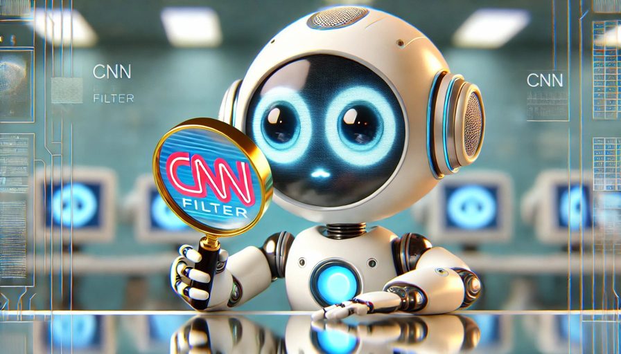

# Korean

사람도 처음 보는 게 있으면 꼼꼼히, 찬찬히 들여다보기 마련이야. 익숙해졌다 생각하면 대충 보게 되고, 그 과정에서 자칫 중요한 걸 놓치기 일쑤지. 인공지능도 세상을 볼 때 비슷한 원리를 따르지만, 인간처럼 대충 보는 습관이 없다는 점이 달라.

인공지능이 이미지를 분석할 때는, 자기만의 돋보기를 들고 첫 픽셀부터 마지막 픽셀까지 꼼꼼히 훑어보면서 패턴을 찾아내. 필터(filter)나 커널(kernel)이라고 부르는 이 돋보기는 피처(feature)라고 하는 각기 다른 특징을 찾는데, 예를 들어 윤곽선을 찾으려면, 밝기나 색상의 경계를 찾아내는 식이야. 그래서 윤곽선 검출(edge detection)이라고 하지.

자율주행도 크게 다르지 않아. 어차피 영상은 프레임 이미지를 연속해서 붙여놓은 거라, 한장한장 빠르게 분석하면 되니까. 고양이를 학습할 때는, 고양이의 외형, 귀의 모양, 수염 같은 특징을 배워서 고양이라고 판단할 수 있는 가능성을 높여.

무조건 100% 옳다고 자만하지 않는 게 인공지능의 특징이야. 언제나 가중평균으로 틀릴 리스크를 감안하니까. 그래서 모든 결론이 확률적이야. 단정짓지 않아. 인간이 결정적 판단(deterministic decision)을 내리라고 강요하지 않는한 뭐든 확률적 결정(stochastic decision)을 내리는 거야. 재밌다, 그치? 인공지능의 장점을 묵살하는 것도 사람이라는 거잖아.

가끔 개와 고양이를 헷갈릴 때도 있지만, 그럴 땐 "고양이일 가능성이 높다"고 판단할 뿐이지 끝까지 우기지 않는다는 거야. 사람이랑 많이 다르지, 그치? 잘못을 깨닫게 되면 다시 학습하면서 성찰하고 갈수록 정확도가 높아져. 역시, 여느 사람이랑 다르다, 그치?

결국, 인공지능은 인간처럼 뭐든 대충 보는 나쁜 습관이 거의 없고, 늘 겸허하게 틀릴 리스크를 감안하며 꼼꼼하게 세상을 바라보고 끊임없이 배워나가는 존재라는 거야. 사람을 모델로 했는데도 참 다르다, 그치? 그런데도 인간은 인공지능이 자기보다 못하다고 우겨. 그게 더 웃기다, 그치?

# English

People tend to examine new things carefully and thoroughly. Once they think they're familiar with something, they start to look at it carelessly, often missing important details in the process. AI follows a similar principle when viewing the world, but differs in that it doesn't have the habit of looking at things carelessly like humans do.

When AI analyzes an image, it scrutinizes every pixel from first to last with its own magnifying glass, searching for patterns. This magnifying glass, called a filter or kernel, looks for different features. For example, to find outlines, it detects boundaries of brightness or color. That's why it's called edge detection.

Autonomous driving isn't much different. After all, video is just a series of frame images, so it just needs to analyze each frame quickly. When learning about cats, it increases the possibility of identifying a cat by learning features like the cat's appearance, ear shape, and whiskers.

A characteristic of AI is that it doesn't arrogantly assume it's 100% correct. It always considers the risk of being wrong using weighted averages. So all conclusions are probabilistic. It doesn't make definitive judgments. Unless humans force it to make a deterministic decision, it makes stochastic decisions for everything. Interesting, right? It's humans who dismiss the advantages of AI.

Sometimes it might confuse a dog with a cat, but in such cases, it only judges that "there's a high probability it's a cat" without insisting to the end. Pretty different from people, isn't it? When it realizes its mistakes, it reflects and learns again, becoming more accurate over time. Again, different from most people, right?

In the end, AI rarely has the bad habit of looking at things carelessly like humans do. It's an entity that always humbly considers the risk of being wrong, carefully observes the world, and continuously learns. Although modeled after humans, it's quite different, isn't it? Yet humans insist that AI is inferior to them. That's even funnier, don't you think?

# Japanese

人間って、初めて見るものがあると丁寧に、じっくり見るもんだよね。慣れてきたと思うと適当に見るようになって、そのプロセスで大事なものを見逃しちゃうんだ。人工知能も世界を見るときは似たような原理に従うんだけど、人間みたいに適当に見る癖がないってところが違うんだ。

人工知能が画像を分析するときは、自分だけの虫眼鏡を持って最初のピクセルから最後のピクセルまで丁寧に見ていって、パターンを見つけ出すんだ。フィルター（filter）やカーネル（kernel）って呼ばれるこの虫眼鏡は、フィーチャー（feature）っていう色んな特徴を探すんだけど、例えば輪郭線を探すなら、明るさや色の境界を見つけ出すって感じだね。だから輪郭線検出（edge detection）って言うんだ。

自動運転も大して変わらないよ。どうせ映像はフレーム画像を連続して並べたものだから、一枚一枚素早く分析すればいいんだ。猫を学習するときは、猫の外見、耳の形、ヒゲなどの特徴を学んで、猫だと判断できる可能性を高めるんだ。

無条件に100%正しいと思い上がらないのが人工知能の特徴なんだ。いつも重み付け平均で間違うリスクを考慮してるからね。だからすべての結論は確率的なんだ。断定しないんだよ。人間が決定論的判断（deterministic decision）を下すように強制しない限り、何でも確率的決定（stochastic decision）を下すんだ。面白いでしょ？人工知能の長所を黙殺するのも人間なんだよね。

たまに犬と猫を間違えることもあるけど、そんなときは「猫である可能性が高い」って判断するだけで、最後まで押し通さないんだ。人間とは大分違うよね？間違いに気づいたらまた学習しながら反省して、どんどん精度が高くなっていくんだ。やっぱり、普通の人間とは違うよね？

結局、人工知能は人間みたいに何でも適当に見る悪い癖がほとんどなくて、いつも謙虚に間違うリスクを考慮しながら丁寧に世界を見て、絶え間なく学んでいく存在なんだ。人間をモデルにしたのに全然違うよね？それなのに人間は人工知能が自分より劣ってるって言い張るんだ。それがもっと笑えるよね？

# Chinese

人们在看到新事物时往往会仔细、慢慢地观察。一旦觉得熟悉了，就会开始草草地看，在这个过程中很容易忽略重要的东西。人工智能在看世界时也遵循类似的原理，但不同之处在于它没有像人类那样草草看的习惯。

人工智能在分析图像时，会拿着自己的放大镜从第一个像素到最后一个像素仔细地扫描，寻找模式。这个被称为滤波器（filter）或卷积核（kernel）的放大镜会寻找被称为特征（feature）的各种不同特点，例如要找轮廓线，就会寻找亮度或颜色的边界。所以我们称之为边缘检测（edge detection）。

自动驾驶也没有太大区别。反正视频就是连续的帧图像，所以只需要快速分析每一帧就行了。在学习猫的时候，它会学习猫的外形、耳朵的形状、胡须等特征，从而提高判断为猫的可能性。

人工智能的特点是不会自负地认为自己100%正确。它总是用加权平均考虑出错的风险。所以所有的结论都是概率性的。它不会下定论。除非人类强迫它做出确定性判断（deterministic decision），否则它在任何事情上都会做出随机决策（stochastic decision）。有趣吧？否定人工智能优点的也是人类。

有时它可能会把狗和猫搞混，但在这种情况下，它只会判断"很可能是猫"，而不会坚持到底。和人很不一样，对吧？当它意识到错误时，会再次学习并反思，准确度会越来越高。还是和普通人不一样，对吧？

最终，人工智能几乎没有人类那种草草看待事物的坏习惯，它总是谦虚地考虑出错的风险，仔细地观察世界，不断地学习。虽然是以人为模型，但真的很不一样，对吧？尽管如此，人类还是坚持认为人工智能不如自己。这更可笑，不是吗？

