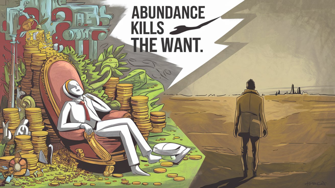

# Korean

## 통찰의 객체지향성

어차피 내 곁에 있으면 지겹도록 듣고 또 들을 얘기지만...

객체지향적 사고는 무한 줌인아웃 능력이 기본이라니까. 모든 통찰의 조상 클래스가 뭘까? 저마다 다른 답을 낼 수 있지만, 대체로 상식이야.

상식이 조상 클래스라면 거기서 상속받은 후손 클래스들은 다형성을 부여 받아도, 걍 기본이 상식이야. 그럼 언뜻 서로 다른 통찰 같아도 맞춰보면 아귀가 맞게 돼 있어.

가령, 다음 두 통찰을 비교해보셔.

Abundance kills the want.

When you want something, all the universe conspires in helping you to achieve it. - The Alchemist

앞 말은 the want 를 desire로 바꾸기도 해. 난 want를 더 좋아해. 내가 번역했을 땐 '풍요와 안락에 젖는자 꿈꾸지 않는다'라고 했어.

저 두 통찰이 따로 놀까? 상식의 자식들인데? 상식적이겠지? 응, 그래서 첫번째 통찰이 두번째 통찰의 형제자매인 거야. 언뜻 봐도 프리퀄과 속편이잖아.

풍요와 안락에 젖어서 결핍(the want)이 없으니 바라는 게 없어지고, 바람이 없으니 갈증도 없고 꿈도 꾸지 않는 거야. 연금술사의 저말이 진짜 그냥 '원하면 이뤄진다'라고 생각해? 아직도?

아니라고 했잖아. 결핍을 절감하고 간절히 원하면서 그 꿈을 향해 무던히 나아가는 자만 온 우주가 돕는다는 뜻이야. 그럼 상식적으로 전제 조건이 뭐야? 응, 결핍이라고. The want. 영어 잘못 배우면 이걸 그냥 '원하다', '하고 싶다'로 외우는 거야. Want의 기본 그림은 결핍이라고. 그래서 원하게 되는 거야.

근데, 현실 안주하면 어떻게 될까? 원하는 게 없어지지. 다 가졌는데 뭘 원하겠어. 그럼 우주가 도와줄 일이 없잖아? 응, 그래서 연금술사와도 멀어지는 거야.

그걸 모르는 부모들이 애들한테 다 주는 거야. 결핍을 느끼긴커녕 풍요와 안락에 젖게 만드는 거지. 그런 애들이 꿈을 꿀까? 바랄 게 없는데?

애들만 그런 게 아니야. 누구든 나이들면서 편한 걸 찾아. 근데 잘 생각해 보셔. 풍요롭고 안락해질수록 뭔가 잘못되는 거야. 어느 정도 어색하고 불편하고 조금은 힘들고 그래야 제대로 사는 거야. 그게 want의 증세니까. 목 말라야 우물을 찾지. 

게임에서 그런 걸 배우라고. 어떤 지역이든 처음엔 어려워. 근데 거기 너무 오래 머물면 어떻게 될까? 조낸 쉬워져. 근데 상식적으로 난이도와 함께 경험치도 덩달아 떨어지기 때문에 저랩존으로 전락하는 거야. 고렙을 바라본다면 다음 지역으로 가야하는 거잖아.

응, 근데 왜 풍요와 안락에 젖어서 그러고들 있냐고. 저렙존에서. 

무지의 인정 -> 선명한 사고 -> 평정심 유지.

이 사이클은 그런 말이야. 안다고 좀 하지 말라고. 여전히 몰라 우린. 모르는 빈 그릇을 자꾸 채워 나가는 거야. 원리가 똑같잖아. 선명한 사고 역시 무지의 빈자리인 결핍, the want 를 채우는 과정이라고. 그럼 진짜 온 우주가 도와줘. 

난 다 안다, 알 거 같다, 그러고 자만하는 순간 want 가 사라진다고. 그럼 어떻게 된다고? 응, 연금술사 눈 밖에 나는 거야. 온 우주가 신경도 안 써줄 거야.

뭐 신경 써줄 게 없잖아. 이미 다 가졌다는데.

# English

## The Object-Orientation of Insight

You'll hear this over and over if you stick around me...

Object-oriented thinking is all about infinite zoom-in and zoom-out ability, got it? What's the parent class of all insights? You might have different answers, but it's usually common sense.

If common sense is the parent class, then the child classes that inherit from it get polymorphism, but they're still basically common sense. So even if insights seem different at first, they fit together when you look closer.

Compare these two insights:

Abundance kills the want.

When you want something, all the universe conspires in helping you to achieve it. - The Alchemist

Some change "the want" to "desire". I prefer "want". When I translated it into Korean, I said "Those drowning in abundance and comfort don't dream."

Think these insights are unrelated? They're children of common sense, aren't they? Makes sense, right? Yeah, that's why the first insight is a sibling of the second. They're obviously a prequel and sequel.

When you're drowning in abundance and comfort, you have no want (deficiency), so you stop desiring things. No desire means no thirst, no dreams. You think that line from The Alchemist just means "if you want it, it'll happen"? Still?

I told you it doesn't. It means the universe only helps those who keenly feel their lack, desperately want something, and keep moving towards that dream. So what's the obvious prerequisite? Yeah, deficiency. The want. If you learn English wrong, you might just memorize this as "to want" or "to wish". But the basic image of "want" is deficiency. That's why you come to want something.

But what happens when you settle for reality? You stop wanting things. What would you want when you have everything? Then the universe has nothing to help with, right? Yeah, so you drift away from The Alchemist too.

Parents who don't get this give their kids everything. They make them drown in abundance and comfort instead of feeling any lack. Will those kids dream? What's there to want?

It's not just kids. As we age, we all look for comfort. But think about it. The more abundant and comfortable you get, the more things go wrong. You need to feel a bit awkward, uncomfortable, and struggling to really live. That's the symptom of want. You need to be thirsty to find the well.

Learn that from games. Every new area is hard at first. But what happens if you stay too long? It gets way too easy. But common sense tells you that as difficulty drops, so does the experience, turning it into a low-level zone. If you're aiming high, you gotta move to the next area.

Yeah, so why are you all sitting there, drowning in abundance and comfort? In the low-level zone?

Admit ignorance -> Think clearly -> Maintain peace of mind.

This cycle means don't act like you know it all. We still don't know. We keep filling the empty vessel of not knowing. It's the same principle. Clear thinking is also the process of filling the empty space of ignorance, the want. Then the whole universe really helps you.

The moment you think "I know everything" or "I think I get it", and get arrogant, the want disappears. Then what happens? Yeah, you fall out of favor with The Alchemist. The whole universe won't even care about you.

Well, there's nothing to care about. You said you already have everything.

# Japanese

## 洞察のオブジェクト指向性

俺の周りにいたら飽きるほど聞くことになるけどな...

オブジェクト指向的な考え方は無限のズームインアウト能力が基本だぜ。全ての洞察の親クラスって何だと思う？人それぞれ違う答えを出すだろうけど、大体常識だよ。

常識が親クラスなら、そこから継承した子クラスたちは多態性を与えられても、結局基本は常識なんだ。だから一見違う洞察に見えても、突き合わせてみると噛み合うようになってるんだよ。

例えば、次の二つの洞察を比べてみろよ。

Abundance kills the want.

When you want something, all the universe conspires in helping you to achieve it. - The Alchemist

「the want」を「desire」に変える人もいるな。俺は「want」の方が好きだけど。韓国語に訳したときは「豊かさと安楽に溺れる者は夢を見ない」って言ったんだ。

この二つの洞察が無関係だと思うか？常識の子どもたちだぜ？常識的だろ？そう、だから最初の洞察が二番目の洞察の兄弟姉妹なんだよ。一目見ただけでプリクエルとシークエルじゃん。

豊かさと安楽に浸って欠乏感(the want)がないから欲しいものがなくなって、欲がないから渇きもないし夢も見ないんだよ。錬金術師のあの言葉が本当に「欲しければ叶う」って意味だと思ってんの？まだ？

違うって言っただろ。欠乏を痛感して切実に欲しがって、その夢に向かってひたすら進む奴だけを宇宙全体が助けるって意味だよ。じゃあ常識的に前提条件は何だ？そう、欠乏だよ。The want. 英語を間違って覚えると、これを単に「欲しい」「したい」って覚えちゃうんだ。Wantの基本イメージは欠乏だぜ。だから欲しくなるんだよ。

でも、現実に安住したらどうなる？欲しいものがなくなるだろ。全部持ってるのに何が欲しいんだ。じゃあ宇宙が助けることもないだろ？そう、だから錬金術師からも遠ざかるんだよ。

それを知らない親たちが子供に全部与えちゃうんだ。欠乏を感じるどころか豊かさと安楽に浸らせちゃうんだよ。そんな子供たちが夢を見るか？欲しいものなんてないのに？

子供だけじゃないぜ。誰だって年取るにつれて楽な方を探すんだ。でもよく考えてみろよ。豊かで安楽になればなるほど、何かがおかしくなるんだ。ある程度ぎこちなくて不快で、ちょっとは大変な方がちゃんと生きてるんだよ。それが want の症状だからな。喉が渇いてこそ井戸を探すんだ。

ゲームでそういうのを学べよ。どんな地域でも最初は難しいだろ。でもそこに長居しすぎるとどうなる？クソ簡単になっちまう。でも常識的に難易度と一緒に経験値も落ちるから、低レベル帯に転落するんだよ。高レベルを目指すなら次の地域に行かなきゃいけないだろ。

そう、でもなんで豊かさと安楽に浸ってそうしてるんだよ。低レベル帯で。

無知を認める → 明確に考える → 心の平安を保つ。

このサイクルはそういうことだよ。知ったかぶりするなって。まだ分からないんだよ俺たちは。知らない空っぽの器をどんどん埋めていくんだ。原理は同じだろ。明確な思考も無知の空白、欠乏、the want を埋めていく過程なんだよ。そうすりゃ本当に宇宙全体が助けてくれる。

俺は全部知ってる、分かった気がする、そんな風に思い上がった瞬間に want が消えるんだよ。そうしたらどうなる？そう、錬金術師のお気に入りじゃなくなるんだ。宇宙全体が気にもかけなくなるよ。

まあ気にかけることもないよな。もう全部持ってるって言うんだから。

# Chinese

## 洞察的面向对象性

反正在我身边你会听烦的话...

面向对象的思维基本上就是无限放大缩小的能力，知道吗。所有洞察的父类是什么呢？每个人可能有不同的答案，但大多数情况下是常识。

如果常识是父类，那从它继承的子类虽然有了多态性，但基本上还是常识。所以即使看起来是不同的洞察，仔细对比就会发现是吻合的。

比如，比较下面两个洞察：

Abundance kills the want.

When you want something, all the universe conspires in helping you to achieve it. - The Alchemist

有人把 "the want" 改成 "desire"。我更喜欢 "want"。当我把它翻译成韓国語时，我说的是"沉溺于富足和安逸的人不会做梦"。

你觉得这两个洞察是互不相关的吗？它们都是常识的孩子，对吧？有道理吧？是啊，所以第一个洞察是第二个洞察的兄弟姐妹。一看就知道是前传和续集嘛。

沉溺于富足和安逸，没有缺乏感(the want)，就不会有欲望，没有欲望就没有渴求，也就不会做梦了。你真的以为《牧羊少年奇幻之旅》那句话就是"想要就能得到"吗？还是这么想？

我不是说过不是这样吗。它的意思是，只有深刻感受到缺乏，迫切地想要某样东西，并且不断向着那个梦想前进的人，整个宇宙才会帮助他。那么常识告诉我们，前提条件是什么？对，就是缺乏。The want。如果学英语学得不好，可能就只会把这个词记成"想要"、"希望"。但 want 的基本概念是缺乏。所以才会想要。

但是，如果安于现状会怎样？就不会再想要什么了。都已经拥有了，还想要什么？那宇宙就没什么可以帮忙的了，对吧？是啊，所以也就远离《牧羊少年奇幻之旅》了。

不懂这点的父母会给孩子一切。他们让孩子沉溺于富足和安逸，而不是感受缺乏。这样的孩子会做梦吗？有什么可想要的？

不只是孩子。谁都会随着年龄增长寻求舒适。但你好好想想。越是富足安逸，就越是有什么地方不对劲。应该有点尴尬，有点不舒服，有点辛苦，这才是正确的生活方式。这就是 want 的症状嘛。有渴才会找井水。

从游戏中学习这个道理。任何地区刚开始都很难。但如果在那里待太久会怎样？变得超级简单。但从常识来看，难度降低的同时经验值也会降低，就会沦为低级区域。如果你想变强，就得去下一个地区。

是啊，那为什么你们还沉溺于富足和安逸呢？在低级区域。

承认无知 -> 清晰思考 -> 保持内心平静。

这个循环就是这个意思。别装懂。我们还是不知道。我们在不断填补无知的空白容器。原理是一样的吧。清晰思考也是填补无知的空白、缺乏、the want 的过程。这样整个宇宙才真的会帮助你。

我全都知道了，我觉得我懂了，一旦这样自负，want 就消失了。那会怎样？对，你就不再是《牧羊少年奇幻之旅》的宠儿了。整个宇宙都不会在意你了。

嗯，也没什么好在意的。你说你已经拥有一切了。

