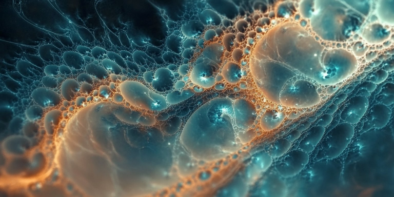

# Korean

대부분 패턴은 시간에 걸쳐 형성된다. 과거의 패턴을 파악할 때 시간의 흐름은 결정적 요소일 수 있다. 시간의 한 순간만 보고 패턴을 잘못 식별하는 건 흔히 범하는 치명적 실수다. 패턴은 대개 정량이 아니라 유량이다. 

물론, 일부 패턴은 반복적이거나 시간 흐름에 따른 여러 스냅샷을 비교하면 식별 가능할 수도 있다. 패턴을 인식하는 데 적절한 시간 범위는 해석하려는 현상에 따라 크게 다를 수 있다.

어느 쪽이든 단순히 한 순간의 정량 스냅샷만 보고 성급하게 결론을 내리면 위험하다. 특히, 편향에 젖어 있을 때는 더욱 그러하다. 본인이 원하는 패턴으로 몰고 가기 때문이다. 패턴은 보통 시간이 지나면서 드러나고, 정확하게 패턴을 식별하고 해석하려면 더 넓은 맥락과 역사를 고려하는 게 중요하다.

시간 여유를 갖고 판단해야 하는 이유다.

# English

Most patterns form over time. When identifying patterns from the past, the flow of time can be a crucial factor. Misidentifying a pattern based on a single moment in time is a common and potentially fatal mistake. Patterns are typically flows rather than stocks.

Admittedly, some patterns may be identifiable if they're recurring or if multiple snapshots across time are compared. The appropriate time scale for pattern recognition can vary widely depending on the phenomenon being interpreted.

Either way, it's dangerous to draw hasty conclusions based solely on a single snapshot of stock. This is especially true when one is biased, as it can lead to forcing the pattern in the desired direction. Patterns usually reveal themselves over time, which is why it's important to consider the broader context and history to accurately identify and interpret them. 

This is why it's crucial to take your time when making judgments.

# Japanese

ほとんどのパターンは時間をかけて形成される。過去のパターンを識別する際、時間の流れが決定的な要素となることがある。一瞬の断面だけでパターンを誤って識別することは、よくある致命的な間違いだ。パターンは通常、静的な量ではなく、流れとして存在する。

確かに、繰り返し発生するパターンや、時間の経過に伴う複数のスナップショットを比較することで識別できるパターンもある。パターンを認識するのに適切な時間スケールは、解釈しようとする現象によって大きく異なる場合がある。

いずれにせよ、単一の静的なスナップショットだけに基づいて性急に結論を下すのは危険だ。特に偏見にとらわれているときはなおさらである。自分の望むパターンに誘導してしまう可能性があるからだ。パターンは通常、時間の経過とともに明らかになるものであり、パターンを正確に識別し解釈するには、より広い文脈と歴史を考慮することが重要である理由だ。

これが、判断を下す際に時間をかける必要がある理由である。

# Chinese

大多数模式都是随时间形成的。在识别过去的模式时，时间的流动可能是一个关键因素。仅基于某一时刻就错误识别模式是一个常见且可能致命的错误。模式通常是流量而非存量。

诚然，一些模式可能是重复的，或者可以通过比较不同时间点的多个快照来识别。识别模式的适当时间尺度可能会因所解释的现象而大不相同。

无论如何，仅基于单一时刻的存量快照就草率地得出结论是危险的。特别是当一个人带有偏见时，这种情况更为严重，因为这可能导致强行将模式引向自己想要的方向。模式通常随着时间的推移而显现，这就是为什么考虑更广泛的背景和历史对准确识别和解释模式如此重要的原因。

这就是为什么在做出判断时需要花时间仔细考虑的原因。

