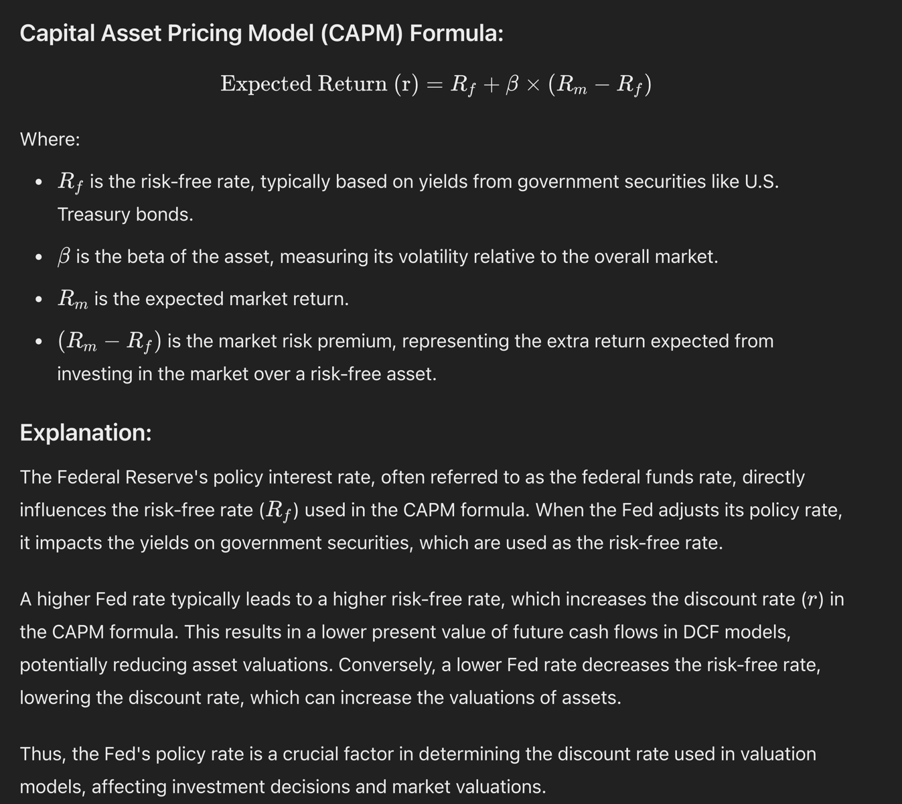

# Korean

금리 인하는 관점에 따라 인식이 달라질 수 있어. 금리 인하를 기대하는 사람은 이를 긍정적인 신호로 받아들이기 쉬워. 아마도 경기 활성화를 위한 조치로 보는 거겠지. 특히 성장주와 같은 롱 듀레이션 주식에 긍정적인 영향을 미칠 거라 확신하는 이유는, 이자율 변화에 민감하게 반응하는 현금흐름할인(DCF) 밸류에이션 모형 때문이야. 여기서 금리는 분모에 영향을 미치기 때문에, 금리가 오르면 기업 가치가 줄어들고, 금리가 내리면 기업 가치는 커지게 돼.

하지만 반대 입장을 가진 사람은 이를 경고 신호로 해석할 수도 있어. 경기침체가 다가올 수 있다는 신호로 말이야.

결국, 이런 해석은 경제 상황뿐만 아니라 개인의 전망과 바람에 크게 좌우돼. 사실, 사람들은 자신에게 유리한 해석을 하려는 경향이 있어. 소유효과와 편향의 결과라고 할 수 있지.

이런 이유로 전문가들이라 해도 이런 해석에 너무 큰 의미를 두지 않는 게 좋아. 그들의 해석도 결국 그들의 상황과 관점을 반영할 뿐이니까. 사람은 언제나 자신의 믿음과 행동을 정당화할 방법을 찾기 마련이야, 때로는 불합리한 상황에서도 말이야. 금융 시장에서는 이런 현상이 특히 두드러지지.

# English

Rate cuts can be perceived differently depending on one's perspective. Those expecting rate cuts are likely to see them as a positive signal. They might view it as a measure to stimulate the economy. The reason they're confident it will positively affect long-duration stocks, like growth stocks, is because of the Discounted Cash Flow (DCF) valuation model, which is sensitive to interest rate changes. Here, the interest rate affects the denominator, so when rates rise, company value decreases, and when rates fall, company value increases.

However, those with an opposing view might interpret this as a warning sign. A signal that a recession could be approaching.

Ultimately, these interpretations are heavily influenced not only by the economic situation but also by individual outlooks and desires. In fact, people tend to interpret things in ways that are favorable to them. This can be seen as a result of the endowment effect and bias.

For this reason, it's best not to place too much significance on these interpretations, even from experts. Their interpretations ultimately just reflect their own situations and perspectives. People always look for ways to justify their beliefs and actions, sometimes even in unreasonable situations. This phenomenon is particularly prominent in financial markets.

# Japanese

金利引き下げは、視点によって受け止め方が異なることがあるんだ。金利引き下げを期待する人は、これを前向きな信号として受け取りやすいんだ。おそらく景気刺激策として見ているんだろうね。特に成長株のようなロングデュレーション株に好影響を与えると確信している理由は、金利変動に敏感に反応するDCF評価モデルのためだ。ここで金利は分母に影響を与えるから、金利が上がれば企業価値は下がり、金利が下がれば企業価値は上がることになる。

でも、反対の立場の人はこれを警告信号として解釈するかもしれない。景気後退が迫っているという信号としてね。

結局、こういった解釈は経済状況だけでなく、個人の見通しや願望に大きく左右されるんだ。実際、人々は自分に有利な解釈をしがちだ。これは保有効果とバイアスの結果と言えるね。

こういった理由で、専門家であってもこういう解釈に深い意味を見出さない方がいいんだ。彼らの解釈も結局は彼らの状況と視点を反映しているだけだからね。人は常に自分の信念や行動を正当化する方法を探すものだ。時には不合理な状況でもね。金融市場では、この現象が特に顕著に現れるんだ。

# Chinese

利率下调的看法可能因人而异。期待降息的人更容易将其视为积极信号。他们可能认为这是刺激经济的措施。特别是对于成长股等长期股票，他们确信会产生积极影响，这是因为现金流贴现（DCF）估值模型对利率变化敏感。在这里，利率影响分母，所以当利率上升时，企业价值下降；当利率下降时，企业价值上升。

但持相反观点的人可能将其解读为警告信号，认为这可能预示着经济衰退的到来。

归根结底，这些解释不仅取决于经济状况，还很大程度上取决于个人的展望和愿望。事实上，人们倾向于做出对自己有利的解释。这可以说是禀赋效应和偏见的结果。

正因如此，即使是专家也不应过分重视这些解释。他们的解释最终也只是反映了他们的处境和观点。人总是会寻找方法来证明自己的信念和行为是正确的，有时即使在不合理的情况下也是如此。在金融市场中，这种现象尤为明显。

However, all these tools, models, and interpretations are used by humans, who are often biased, emotional, and irrational. They just torture any data until it confesses to their beliefs and actions.
