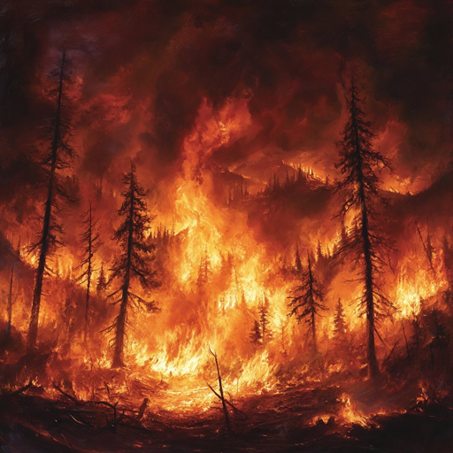

# 숲에 불이 났을 때 살아남는 법

"숲에 불이 났는데 성할 나무는 없다. 또, 숲에 불이 났다 해도 모든 나무가 불타 없어지는 것도 아니다. 숲에 불이 나도 살아남을 만한 생명력 강한 나무를 선택하는 것이 현명한 투자자의 몫이라는 말이다."

"투자에 관련된 모든 리스크는 사실 투자자 자신에서 비롯된다 할 수 있다. 숲에 불이 났다고 호들갑 떨다 초가삼간 태워먹으며 시장 리스크를 확정 짓는 것도 투자자 자신이요, 개별 종목 리스크에 해당하는 나무 선택 역시 투자자의 몫이라는 거다. 불에 잘 타지 않는 은행나무라면 모를까 바짝 마른 참나무만 고른다면 조만간 아예 숯 장사로 나서야 할지도 모를 일이다. 역시 결론은 투자자 펀더멘털이다."

기록하는 자와 기록하지 않는 자의 차이야. 또, 문맥을 이해 하는 자와 이해 못 하는 자의 차이고.

대두족장 투자병법에서 인용한 거야. 늘 강조하지만 저 책 자체가 내 기록이라고 했잖아. 이 책을 쓰기 전후로 내가 정말 수도없이 기록했던 말이야.

"숲에 불이 났는데 멀쩡한 나무는 없다."

어떤 식으로 포장하든 대전제는 '숲에 큰 불이 날수록 성한 나무는 절대 없다'는 거야. 근데, 특히 소유효과(endowment effect)가 끼어들면 '우리 애가 그럴 리가 없어요' 증세가 워낙 심해지기 때문에 내 나무는 타지 않는다는 비상식적인 확신을 갖곤 해.

윤리가 없는 암흑의 숲을 배회하는 터미네이터 힌트도 드렸잖아. 이젠 오로지 '돈을 벌기 위해서는 수단과 방법을 가리지 않는' 인공지능까지 동원되는 세상이라고.

아니, 그 전에도 그랬어. 암흑의 숲에서 암약하는 이들은 이미 그대들의 약점을 누구보다 잘 안 다는 거야. 터미네이터는 말할 것도 없고.

"터미네이터처럼 작동하는 인공지능은 윤리나 인간적 판단 없이 오로지 데이터를 바탕으로 효율적이고 잔혹한 결정을 내리기 때문에, 개인 투자자들이 갖고 있는 감정적, 심리적 약점을 무자비하게 활용할 거야. 시장에서 흔히 보이는 공포에 따른 매도나 탐욕에 따른 매수와 같은 행동들이 그런 인공지능에게는 너무나도 예측 가능한 타깃이 될 거고, 그 결과로 개인 투자자들은 쉽게 무너질 수 있겠지."

힌트로 드렸던 인공지능 딸 피파와 대화에서 피파가 했던 말이야. 

엑스를 10분만 샘플링해봐. 숲에 불이 났는데도 자기 나무는 멀쩡하다고 신이 난 사람 천지야. 존재조차 알리지 말아야 할 암흑의 숲에서 그렇게들 소리를 지른다고.세상 만물 객체이고 정규분포라고 했잖아. 시장에 어떤 먹잇감이 배를 드러내고 누워 있는지 샘플링하기 어렵지 않아.

여러분이 늘 간과하는 부분이 있어. 시장 유동성의 성격이야. 

최근 유동성은 누가봐도 단기성이야. 엔캐리 트레이드가 대표적이야. 오래 버티지 못하는 '단기성' 자금이라는 뜻이야. 암흑의 숲에서 선빵을 날릴 정도의 규모가 큰 단기성 자금이라면 어떤 식으로든 이익을 취하려 들기 마련이야. 지금은 더 조급해진 상황이고. 특히 엔캐리 트레이드 자금은 진짜 오래 못 가. 엔화 강세 이어지고 미국에서 금리 인하가 현실이 되면 청산쪽으로 갈 수밖에 없는 초단기 자금이야. 그 자금으로 떠받치는 시장이라면 정말 위험한 거야. 그럼 얘네들은 어떤 선택을 할까? 둘 중 하나야. 남보다 먼저 선빵을 날려서 빨리 청산할 분위기를 만들고 빠지거나, 시장 분위기에 따라 반대 포지션을 잡는 거야. 컨센서스는 시시각각으로 바뀌니까. 어느 쪽도 개인투자자한테는 대처가 불가능해. 

개인투자자들이 황새 흉내를 내며 레버리지를 끌어다 쓰고, 파생에 손을 대면서 파멸의 길로 접어드는 건 정말 안타까운 일이야. 쟤들이 그걸 모르지 않고, 쟤들이 풀어놓는 터미네이터가 그걸 모르지 않는다는 거야. 쟤들이 왜 그대와 '같이 벌자'고 할거라고 생각하는지 10초만 고민해보시라고.

또, 쟤들이든 걔들이든 암흑의 숲에서는 어차피 서로 존재를 모를 수 있고 피아 구분도 안 된다고 했잖아. 서로 회의하고 문자 주고 받고 전화 때려서 만들어지는 컨센서스가 아니라는 거야. 누가 선빵 날릴지 모르는 암흑의 숲이라니까.

난 여전히 그 암흑의 숲에 그대들이 발을 디디는 것 자체에 반대해. 게다가 제정신을 유지할 수 없는 곡성이야. 시장이 암흑의 숲이자 곡성이라는 사실은 쟤들이든 걔들이든 그대든 어느 플레이어나 매한가지야. 근데 쟤들이나 걔들은 잃어도 남의 돈이야. 쟤들이나 걔들은 거의 대부분 OPM(Other People's Money) 매니저들이라고 했잖아. 자기 돈 굴리는 큰 손이라도 여러분과는 달라. 잃어도 살아남을 자들이라 큰 손이라고 하는 거야. 게다가 진짜 큰 손이면 그렇게 잃을 짓을 안 해.  

그대들은 피같은 자기 돈이며, 한두번 잃으면 온 가족이 불행해진다는 점이 달라. 

시산혈하 상황이 왔는데 이미 대비가 늦었다면 그대가 취할 수 있는 전략은 딱 둘이야.

첫째, do nothing. 아무 것도 하지 않는다. 이게 아마 가장 현실적일 거야. 그나마 생존률이 가장 높아.
둘째, 장기 성적표로 검증된 위기 대응 전략이 있다면 그대로 실행한다. 없을 거야. 본인이 더 잘 알테니 우기지 마시고. 그럼 첫째로 돌아가야지.

이미 대비가 늦었다는 건 '둘째' 시나리오가 불가능하다는 뜻이고, 그런 무형자산을 갖춘 투자자가 아니라는 반증이기 때문에 결국 do nothing이 유일한 대응책일 수밖에 없어.

그럼 Do Nothing의 의미를 다시 고민해보셔. 정말 그냥 아무 짓도 안 하는 건지. 해야할 게 많아. 여기서 하지 말라는 건 아무 근거 없이 공포에 팔고 탐욕에 사는 행위를 하지 말라는 것 뿐이야. 할 건 해야 해.

첫째, 꼼꼼히 기록해야 해. 왜 이 지경까지 난 늘 풀빵인지. 왜 패턴 인식이 전혀 안 되는지. 패턴은 장기간에 걸쳐 형성되는 건데 왜 단기 스냅샷만 보고 판단하는지.
둘째, 다짐해야 해. 살아남아야 하니까, 어떤 유혹이 있더라도 레버리지를 쓰지 않을 것이며, 단기 자금을 투입하지 않겠다고. 글로 쓴 서약이라도 만들어. 도장이라도 찍어. 반려자한테 약속해. 애들 얼굴 보고라도 약속해. 그래도 힘들 거야. 근데, 안 그러면 더 힘들어 질거야. 시장은 곡성이라 그댄 제정신을 유지 못 할 거고, 암흑의 숲을 배회하는 터미네이터는 늘 그댈 노릴 테니까.
셋째, 자금 상황을 다시 점검하고 냉철하게 포트를 조절한다. 상황이 악화되면 언뜻 장기 자금이라고 생각했던 종자돈도 단기자금으로 전락하기 일쑤야. 그러기 전에 냉철하게 고민해야 해. 정말 몇 년씩 묻어둘 수 있는 자금인지. 대부분 아닐 거야. 우기지 마시고. 아니라면 이 또한 레버리지나 다름 없어. 특히, 요행히 올해 좀 벌어서 내년에 양도세를 내야 하는데 여전히 그 양도세마저 몰빵을 하고 있다면, 그댄 장투 자격이 없는 거야. 

물론, 나도 그대에게 이래라 저래라 할 자격은 없어. 그냥 그대나 그대 가족이 불행해지는 게 싫을 뿐이야. 그만큼 세상이 어두워지는 게 정말 싫고.

위기를 감지할 때마다 직접적으로 소리치지 않고 힌트만 주는 건 그대 몫이기 때문이고, 내 나름 책임회피 수단일 수도 있어. 소리쳐 봐야 기스난 자존심에 돌만 던지는 세상이라 부작용이 워낙 심한데다 장기적으로 그대들에게도 큰 도움이 안 되는 것도 사실이야. 힌트를 알아채는 건 제정신이 남아 있는 사람 뿐이거든. 

시장을 떠나는 방법은 두 가지야. 자발적으로 떠나거나, 퇴출 되거나.

난 아직도 그대가 한시라도 빨리 자발적으로 떠나길 바래. 퇴출되면 성찰이나 성장 기회도 없이 말그대로 쫓겨나는 거야. 

어떻게든 살아남아야 한다면, 제발 현명하게 대처하셔. 행여 기스난 자존심 세우지 좀 말고. 애들 얼굴 봐서라도 이겨내라고. 솔로면, 내가 해줄 조언조차 없어. 그냥 하지마.

주기적으로 이런 말 하고 글 쓰는 거 정말 싫은데, 할 수밖에 없어. 사람된 도리니까.

살아남아. 제발.

