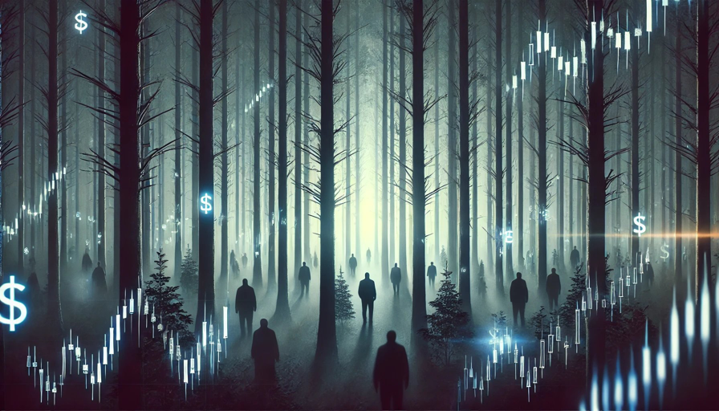

# 암흑의 숲 - 전쟁터, 정치판, 금융시장

어차피 소설, 시나리오 쓰는 거야. 가중평균해서 들으셔. 개인적으로는 의심의 여지가 없다고 여기지만, 그대는 생각이 다를 수도 있어.

근데, 믿는 쪽이 안전할 거야. 안 믿는 쪽이 훨씬 위험하니까.

삼체의 암흑의 숲 이론이 적용된다는 건 '윤리가 없다'는 전제야. 우주라면 말할 것도 없는데, 인간 세상에도 그런 영역은 존재한다고. 있는 듯 하지만 없다고 보는 게 안전하다는 거야. 그래서 선빵을 날리는 게 언제든 안전하다도 여겨지는 곳... 응, 전쟁터, 정치판, 금융시장이 대표적이야.

이미 여러 차례 설명했으니, 넘어갈게. 그냥 응용해 보셔.

이번 인공지능 규제 리스크를 '윤리가 없는' 정치판과 금융시장이라는 암흑의 숲 이론으로.

규제는 누가 할까? 응, 당국이 해. 그럼 먼저 알겠지? 규제할 거라는 걸. 알아도 선빵 날리기(front-running)를 안 할 거다... 정치인들이 그 정도 도덕군자라고 생각하면 너무 순진한 거야. 금융시장이라고 다를까? 결탁이라는 말이 괜히 나오지 않아. 아니, 결탁까지 가지 않더라도 서로 눈치깔 수도 있어. 공감대, 컨센서스가 만들어진다는 거야. 

주요 샘플링 데이터 포인트의 대표성을 강조하는 이유야. 있어, 그런 친구들. 금융 거물 중에도 있고, 정치인 중에도 있고, 하다못해 정치인 남편 중에도 있어... 

그럼 더 중요한 건 뭐다? 응, 보이는 애들 말고 얘들이 대표하는 안 보이는 애들. 그 안 보이는 애들까지 전부 펼쳐보면 그게 암흑의 숲이야.

이런 이벤트를 기록도 안 하고, 사고도 안 하고, 프레임에 갇혀서 그렇게 그냥 넘기면, 응, 또 당해. 

시장은 곡성이자 암흑의 숲이야. 늘 누군가 선빵을 날려. 피아 구분도 안 되는 곳이야.

