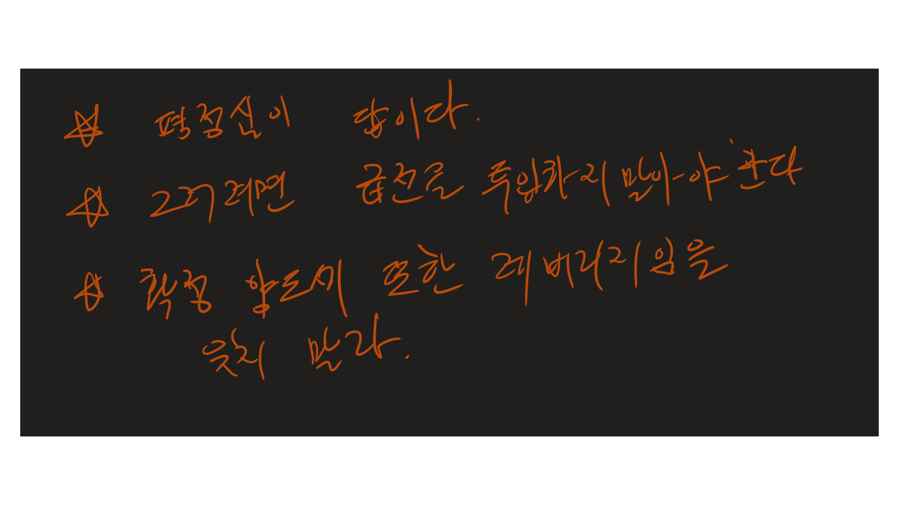
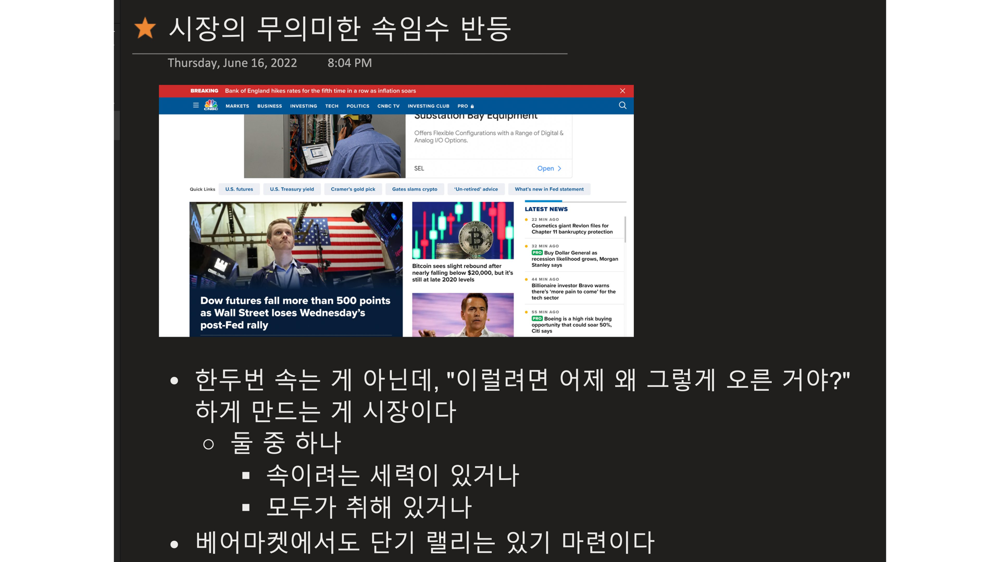
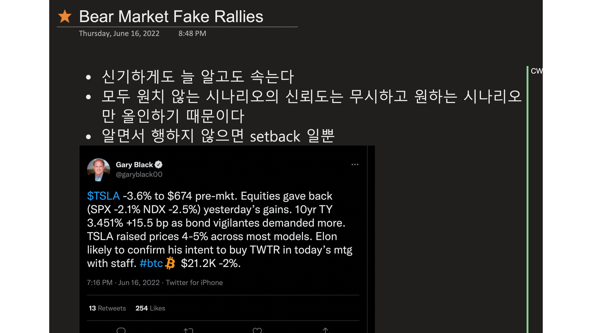
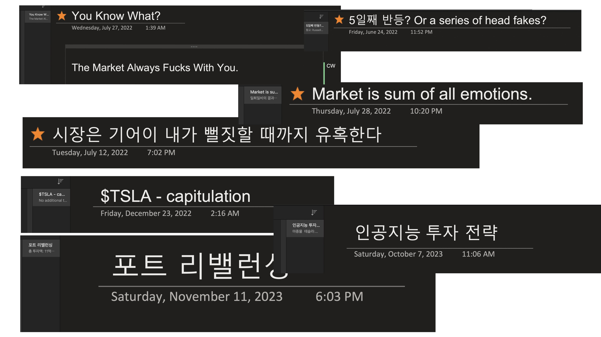

절 아는 분들만 참고하세요. 행복줍줍 방송도 봤고 '좋은 이웃'이 어떤 함의를 갖는지 아는 분들만... 리포스트 금지.
 
리포스트를 금지하는 이유는 모르는 사람은 오해할 리스크가 너무 커서 그래요. 여러분도 마찬가지니 문맥 잘 아는 분만 참고하세요.
 
2022년 초부터 시작된 이전 폭락장의 원노트 기록입니다. 대충 어떻게 하는지도 보여드리는 건데, 개인적인 내용도 많고, 오해의 소지가 있을 부분 (문맥)은 빼고 주요 포인트만 보여드리는 겁니다.
 
여러분도 늘 이런 기록이 있어야 돼. 미래의 나한테 보내는 천군만마. 
 
제 경험도 그렇지만, 정말 많은 분들이 오해하는 게... 타임라인입니다.
 
사람은 뭐든 단기적으로, 자기 바라는 대로만 보는 아주 몹쓸 습성이 있어요.  
 
대부분 투자자에게 2022년 폭락장은 연말을 넘어 2023년까지 이어졌어요.
 
또들 그러실 거야. This time is different. 응, 인류 역사 내내 한 소리야. 
 
그래서 기록을 남기고 역사를 상속받으면서 현재의 다형성을 가중평균하라는 거야... 버핏처럼. 버핏도 다는 안 빼잖아.
 
나도 늘 가중평균이야. 비중 조절. 시나리오가 달라진다 싶으면 가능성 높은 비중으로 갈 뿐인 거고. 이걸 알아도 Execution is the hardest 인 거고. 주식쟁이 마지막 오의야. 자기 판단을 믿는 단계에 이르면 (또 트렉 레코드로 검증된 투자자라면) 번개 같은 execution. 그래야 살아남거든. 시장 유혹에 흔들리지 않고 나 안의 '그놈 목소리'에도 휘둘리지 않는.  
 
2022년 첫 신호가 떴을 때 빨간 글씨(정말 중요할 때는 감정을 살리기 위해 원노트에 펜으로 씁니다)로 이렇게 썼어요.
 
- 평정심이 답이다
- 그러려면 급전을 투입하지 말아야 한다
- 확정 양도세 또한 레버리지임을 잊지 말라
 
저 세금 부분은 당해본 분들은 알 거야. 벌었다고 세금 계속 굴리다 결국 벌지도 못 했는데 양도세 내는 꼴. 양도세는 확정되는 순간 내꺼 아냐. 나라꺼야. 빼놔야 돼. 난 이걸 매년 지켜. 올해도 지키고 있어. 실현한 양도세는 손 안 대. 폭락장이 아니라 폭락장 할아비가 와도. 그럴 수 있어야 돼. 한번은 뭣 머르고 당해도 두 번 당하면 바보인 거야. 매는 한번만 맞아보면 족해요. 세금도 레버리지로 쓰지마셔. 
 
이런 현상도 써 있고...
 
- 설마하는 선까지 급전직하 폭락한다
- 아무런 (언뜻 선명한: 예 - 어닝 비트) 호재도 무력화된다
- 투매가 2-3번 이어지고 끝내 공포장이 찾아온다. 투매는 (상승하는 척하다) 급반전으로 마무리된다.
- 공포의 크기: 아무리 싸 보여도 나조차 선뜻 손이 나가지 않는다.
 
응, 늘 알고 실천하는 데도 또 다짐하는 거야. 난 ㅈㄷ 모르니까. 원점에서 다시.
 
첫번째 투매 동참 어쩌고 하는 이유는... 돈 많은 애들은 롱 포지션을 잡았다가 폭락이 시작되도 잃을 게 없어. 왜냐하면 던지고 다시 받을 수 있는 구조거든. 그게 1차 투매 생리야. 이때 herd 는 죽어라 버텨. 1차 투매 세력은 이런 짱구인 거고... '1차에 던지고 2-3차에 받아도 남는 장사다.' 이걸 어떻게 아냐면 어차피 herd 는 레버리지까지 써 가며 버틸 거거든. 언제 때리면 무너질지 다 알 수 있어. 데이터가 뻔히 나와 있으니까. 그중 하나가 신용잔고인 거고. 또, 여러분이 죄다 트위터에까지 까발리잖아. 학습 데이터셋도 조낸 많은 거라고. 그럼 1차 투매 동참하고 거기까지 버텼다가 받아 먹자는 '컨센서스'가 만들어져. 이전에도 말했지만 진짜 세력들이 존재하는 게 아니라, 전국구 수준 애들끼리 염화시중의 미소라고 여기시면 돼. 실제로 그렇게들 벌어 폭락장에서. 숏 때리고 뭐 그래서만 버는 게 아니고. 나중에 돌이켜 보셔. 1차 투매에 동참했던 애들이 2-3차에 받으면 얼마 잃고 얼마 벌게 되는지 손익구조 뻔하니까. 본인 경험 돌이켜봐도 되고.  
 
또 한가지, 잊지 마셔. 개인 투자자나 투자가 가족지대사야. 금융쪽 친구들은 걍 모든게 콜옵션이야. 지가 못 해도 프리미엄만 날리면 되고, 잘하면 떼돈 버는. 그래서 이 친구들 손익구조는 콜옵션 구조야. 책임은 거의 안져도 되거든. 그래서 OPM(other people's money) 매니저는 신뢰하는 게 아냐. 그게 누구든! 남의 돈 함부로 굴리면서 책임은 안 져도 되는 직업이라고. 
 
그 다음 속임수 반등 관련 기록이 죽 이어집니다. 꽤 오래... 몇 달... 영어로 head fake 라는 표현 찾아보세요. 그게 그뜻이니까.
 
왜 이런 head fake가 지속되는지 혼자 설명해 보시고... 썰풀면서 설득해 보셔. 
 
젤 많이 하는 말 중 하나: "이럴려면 대체 어제 왜 그렇게 오른/떨어진 거야?" 이번에도 이짓들 했어. 또 그럴 거고.
 
이해하려 들면 안 돼. 곡성이 원래 그래. 참고로, GB든 누구든 전 샘플링 데이터 포인트일 뿐 아무도 믿지 않아요.
 
마지막 제목 보면... '시장은 기어이 내가 뻘짓할 때까지 유혹한다.' 그게 곡성이야. 그 당시 트위터 접기 전에도 수없이 반복 트윗 날렸어. 우리 모두 뻘짓하며 항복할 때까지 (어느 쪽이든) 시장 유혹은 끝나지 않는다고. 실제로 그랬어. 선배들이 괜히 시장이 4차원 괴물같은 생명체라고 하는 게 아냐. 어떻게든 하나하나 찾아내서 끝까지 괴롭혀. 뻘짓할 때까지. 유일한 방법은 면벽자가 되는 거야. 시장(지자, Sophone)이 생각을 읽지 못하는 존재. 아니면 아예 존재조차 까먹게 만드는 거지. 내가 그렇게 살려고 애쓰는 거고. 
 
엄청난 마진 쓰기로 유명한 '그' 양반도 2022년 연말, 결국 항복하고 마진 덜어냈었고... 그걸 또 자랑스레 트윗 올리기에 난 샘플링 데이터로 삼았고. 그게 'Capitulation' 이야. 무려 그해 12월 얘기고. 양도세 억울하게 안 내려면 워시 세일도 해야 하는 시기니까...
 
연말 지나고 2023년이 돼서야 인공지능 시장이 열렸네요.
 
이것도 교훈이야. 한곳만 바라보면 그것만 보여. 세상이 달라져도. 인공지능은 모두가 고민했어야 해. 테크충이라는 나도 늦은 편이야. 그걸 반성한 기록이고.
 
그게 인간이야. Endowment effect의 폐해고.
 
'응, 알 거 같아' 고개만 끄덕거리는 사람과 실제로 기록을 남기는 사람이 있어. 자신만의 철저한 기록.
 
장기전에서 누가 이길지, 아니 누가 살아남을지 고민해 보셔.
 
이 글은 지울지도 몰라. 부작용이 있다 싶으면.

